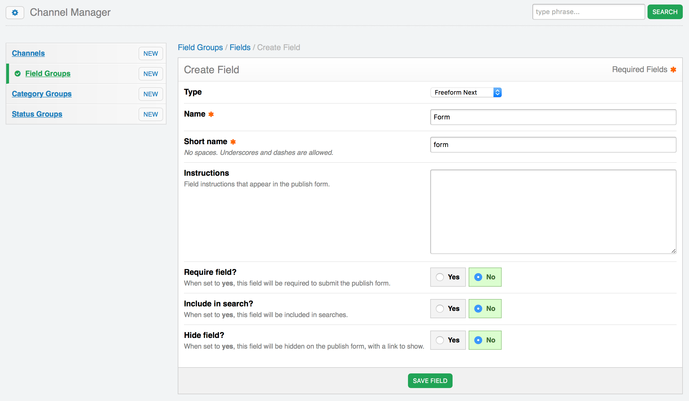

# Channel Fieldtype

Freeform includes a channel fieldtype that allows you to attach forms to Channel Entries, so that you can display a form with your entry automatically inside the  [Channel:Entries](https://docs.expressionengine.com/v3/channel/channel_entries.html) tag. This method does force using a [Formatting Template](formatting-templates.md) to control its output.

Here's an overview on how to use this field type:

* [Creating a Freeform channel field](#create)
* [How the Fieldtype works](#how-works)
* [Displaying the Form in EE Templates](#examples)

## Creating a Freeform field <a href="#create" id="create" class="docs-anchor">#</a>
Creating a Freeform Next Form field is done just like any other fieldtype, here's an overview of the process:

* Go to the **Channel Fields** area in the CP. Select the appropriate **Field Group**, and then click the **Create New** button.
* For the Type, select *Freeform Next* (or *Freeform Next Pro*) from the list.
* Name the field as you wish - for example **My Form** with short name of **my_form**.
* There are no special field options for the Freeform Next field type.
* Click *Save Field* to save the new custom field.
* If you wish to create more Freeform Next fields, just follow the procedure above again.

Your Freeform Form/Submissions field is now available to be assigned to other sections.

## How the Fieldtype works <a href="#how-works" id="how-works" class="docs-anchor">#</a>
Once you have a Freeform Next channel entry field setup, and you've created a form with Composer, assigning a form to a channel entry is very easy!

* Go to the *Publish* area in the EE control panel. If the field group the Freeform field belongs to is assigned to the channel you selected, you should now see the special Freeform field.
* To add a form, simply select the form name from the select field list.
* Once you have submitted or updated the channel entry, that's it! The form has now been assigned to the entry.

## Displaying the Form in EE Templates <a href="#examples" id="examples" class="docs-anchor">#</a>
To have the Freeform form display in your EE templates, simply specify the short name of the custom channel field as a variable inside of the [Channel:Entries](https://docs.expressionengine.com/v3/channel/channel_entries.html) tag. If a Freeform form has been selected for the entry, the form will parse fully from that variable.

	{exp:channel:entries}
		<h2>{title}</h2>
		
{body}

		{freeform_form_fieldname}
	{/exp:channel:entries}
