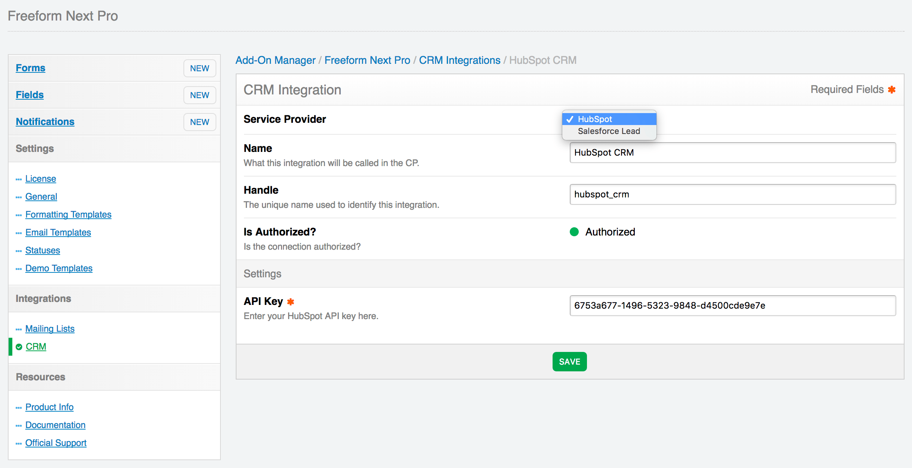

# CRM API Integrations

Freeform Next Pro supports some popular CRM (Customer Relationship Management) API integrations. Inside the **Integrations** area of Freeform, there is a CRM API Integration Manager, which allows you to manage your CRM API integrations. If you currently have Freeform Next Basic, you can [purchase an upgrade to Freeform Next Pro in your account area](https://solspace.com/account/software).

The following CRM integrations are currently available for *Freeform Next Pro* (click each one for individual setup instructions):

* [Salesforce](crm-api-salesforce.md)
* [HubSpot](crm-api-hubspot.md)
* [SharpSpring](crm-api-sharpspring.md)

Some important things to know about CRM integrations are:

* CRM integrations are globally available to all forms, but are configured per form inside the Composer interface.
* Most - if not all - integrations attempt to map all available fields and custom fields, but some may have limitations if the API is too complex or doesn't allow it.
* If a CRM integration has been configured, you will see a **CRM** button at the top of the **Property Editor** (right column) in Composer. To configure the CRM for a form, click that button and then select an integration name from the options. You may then map out your Freeform fields to your CRM's fields.

Every integration is a little bit different, so we have detailed instructions for setting up each integration on their own page.
