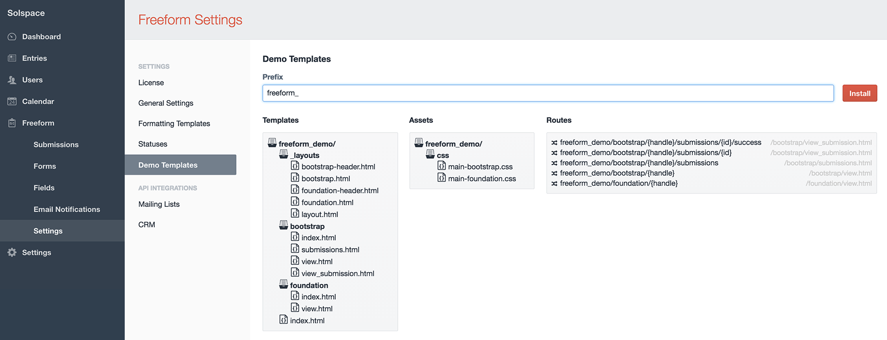

# Demo Templates
Freeform Next includes a complete set of demo templates. These demo templates let you have a fully functioning area on your website with just a couple clicks! Further to this, it allows you to see real world examples of the template code in action, which will help you get acquainted with Freeform Next quicker.

## Installing the Demo Templates <a href="#install" id="install" class="docs-anchor">#</a>

To install the Demo Templates, simply visit the **Demo Templates** nav item in Freeform (**Freeform Next > Settings > Demo Templates**).

By default, the Demo Templates page will be set to **freeform_next_demo** for template group name. You can change this to whatever you like.

During installation of demo templates, Freeform will copy the templates over to the Template Manager for EE. The default CSS and JS assets for demo templates are located in the **./themes/user/freeform_next/lib/codepack/** directory.

Using the above example, your templates would be located at:
**http://yoursite.com/freeform_next_demo/**

If you encounter any issues trying to install the demo templates, it's likely that your database user does not have sufficient privileges or your server configuration does not allow some or all of the actions.
