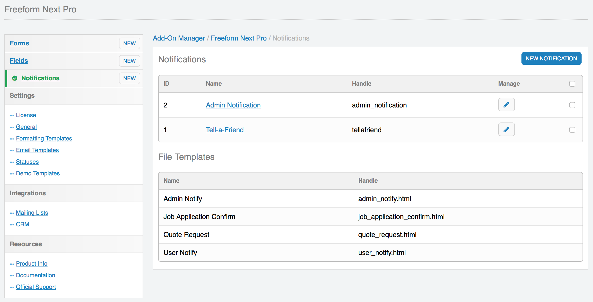
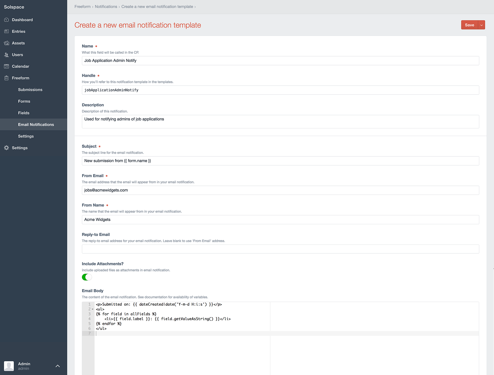

# Email Notifications

Freeform Next allows you to send email notifications upon submittal of a form. They are global and can be reused for multiple forms, saving you time when you are managing many forms.

* [Assigning Notifications to Fields/Forms](#assigning-notifications)
* [Overview of Email Notification Template Options](#notification-template-options)
* [Managing Email Templates within EE CP (Database)](#notification-template-database)
* [Managing Email Templates as HTML Files](#notification-template-files)
* [Template Examples](#examples)


## Assigning Notifications to Fields/Forms <a href="#assigning-notifications" id="assigning-notifications" class="docs-anchor">#</a>

Email notifications can be sent to email address(es) specified for admins (in the **Notify** section of Composer (right column) as well as email addresses specified/selected in the [Email](fields-field-types.md#fields-email) and [Dynamic Recipients](fields-field-types.md#fields-dynamic-recipients) field types. To assign an email notification template to these fields, click on the field in Composer, and then in the Property Editor (right column), select a notification template you want used to generate an email notification for the entered/selected email address. Email notifications can even be done [dynamically at template level](form.md#param-dynamicnotification).


## Overview of Email Notification Template Options <a href="#notification-template-options" id="notification-template-options" class="docs-anchor">#</a>

[](images/cp_notifications-list.png)

Email notification templates can be managed 2 different ways:

1. As *[database entries](#notification-template-database)* within the EE control panel in the **Notifications** page in Freeform Next (**Freeform Next > Notifications**).
2. As *[HTML template files](#notification-template-files)* within the EE Templates directory.

In addition to this, email notification templates can be created directly at form level within Composer. Email templates created this way are subject to the [Default Email Notification Creation Method](settings.md#default-email-method) preference in Freeform settings. Email notification templates that are created within Composer will contain basic default content and should be checked and updated once finished building your form.


## Managing Email Templates within EE CP (Database) <a href="#notification-template-database" id="notification-template-database" class="docs-anchor">#</a>

[](images/cp_notifications-create.png)

Database templates are managed within the EE control panel in the **Notifications** page in Freeform (**Freeform Next > Notifications**). Email Notification templates contain the following options:

* **Name** <a href="#name" id="name" class="docs-anchor">#</a>
	* A common name for the notification template to identify it easier.
* **Handle** <a href="#handle" id="handle" class="docs-anchor">#</a>
	* The unique identifier for the notification template, used when in your regular templates when specifying a notification template.
* **Description** <a href="#description" id="description" class="docs-anchor">#</a>
	* A description for the notification template to help identify what it's used for, etc.
* **Subject** <a href="#subject" id="subject" class="docs-anchor">#</a>
	* The subject line for the email notification.
		* Can include any Freeform field variables (`{field_name}`) as well as `{submission:id}` and `{form:name}` (where `{form:name}` is the name of the form, not a custom field).
* **From Email** <a href="#from-email" id="from-email" class="docs-anchor">#</a>
	* The email address the email notification will appear from.
		* Can include any Freeform field variable (`{field_name}`).
			* **NOTE:** Using dynamic approach with a variable could have your emails marked as spam.
* **From Name** <a href="#from-name" id="from-name" class="docs-anchor">#</a>
	* The email address the email notification will appear from.
		* Can include any Freeform field variables (`{field_name}`).
			* Ex: `{first_name} {last_name}`
			* **NOTE:** Using dynamic approach with variables could have your emails marked as spam.
* **Reply-to Email** <a href="#replyto-email" id="replyto-email" class="docs-anchor">#</a>
	* The email address the email notification will has set for Reply-to.
		* Can include any Freeform field variable (`{field_name}`).
			* **NOTE:** Using dynamic approach with a variable could have your emails marked as spam.
		* Leave blank to use the **From Email** address.
* **Include Attachments** <a href="#include-attachments" id="include-attachments" class="docs-anchor">#</a>
	* Include uploaded files as attachments in email notification.
* **Email Body** <a href="#email-body" id="email-body" class="docs-anchor">#</a>
	* The HTML body of the email notification to be sent.
		* Can include any Freeform field variable (`{field_name}`) as well as `{form:name}` (the name of the form, not a custom field), `{form:id}`, `{form:handle}`, `{submission:id}` and `{date_created format="%l, %F %j, %Y at %g:%i%a"}`.
			* Available field options:
				* `{field:field_name:label}` - displays the label (name) of the field.
				* `{field:field_name:value}` - displays the option label(s) submitted.
					* Example: `Apples`
					* Array of data example: `Apples, Oranges`
				* `{field:field_name:handle}` - displays the handle of the field.
			*  <a id="email-body-file-uploads" class="docs-anchor"></a>For displaying URL's to uploaded files, you'll want to pair this with the [EE File Entries tag](https://docs.expressionengine.com/v3/add-ons/file/file_tag.html). The file upload field value will parse as the uploaded file ID, which can then be fed to the `{exp:file:entries}` template tag. A final solution might look something like this:

				```{if my_file_upload_field}
					{exp:file:entries file_id="{my_file_upload_field}"}
						{file_url}
					{/exp:file:entries}
				{/if}```

		* Can also use `{form:fields}{/form:fields}` variable pair to automate parsing of fields.
			* Will only parse fields that contain data.
				* File upload fields will be excluded from this, but can be displayed manually. See [example above](#email-body-file-uploads).
			* Fields will be displayed in order of how they are laid out in Composer.
			* Available fields:
				* `{field:label}` - displays the label (name) of the field.
				* `{field:value}` - displays the option label(s) submitted.
					* Example: `Apples`
					* Array of data example: `Apples, Oranges`
				* `{field:handle}` - displays the handle of the field.


## Managing Email Templates as HTML Files <a href="#notification-template-files" id="notification-template-files" class="docs-anchor">#</a>

HTML template files have the same options as [Database templates](#notification-template-database), but since all of the content is stored within a template (and nothing in the database), these template files will have a heading comment block of code with configuration options.

To clarify, your template code would look no different than how it does for Database template method, except you'd have a comment block at the top of the template with config options like this:

	{!-- subject: New submission from the {form:name} form --}
	{!-- fromEmail: {webmaster_email} --}
	{!-- fromName: {webmaster_email} --}
	{!-- replyToEmail: {webmaster_email} --}
	{!-- includeAttachments: y --}
	{!-- description: A description of what this template does. --}

That is the default set of config data, but you can of course adjust it to whatever you like.


## Examples <a href="#examples" id="examples" class="docs-anchor">#</a>

Below is a basic automated example for database method:

	<h2>New submission from the {form:name} form</h2>

	<p>Submitted on: {date_created format="%D, %F %d, %Y - %g:%i:%s"}</p>
	<ul>
	{form:fields}
		<li>{field:label}: {field:value}</li>
	{/form:fields}
	</ul>

And here is the same example but for HTML file method:

	{!-- subject: New submission from the {form:name} form --}
	{!-- fromEmail: {webmaster_email} --}
	{!-- fromName: {webmaster_email} --}
	{!-- replyToEmail: {webmaster_email} --}
	{!-- includeAttachments: y --}
	{!-- description: New submission sample email template --}

	<h2>New submission from the {form:name} form</h2>

	<p>Submitted on: {date_created format="%D, %F %d, %Y - %g:%i:%s"}</p>
	<ul>
	{form:fields}
		<li>{field:label}: {field:value}</li>
	{/form:fields}
	</ul>

---

Below is a manually built example for database method:

	<p>The following submission came in on {date_created format="%D, %F %d, %Y - %g:%i:%s"}.</p>
	<p>Here are the details:</p>
	<ul>
		<li>Name: {first_name} {last_name}
		<li>Email: {email}
		<li>Home Phone: {home_phone}
		<li>Cell Phone: {cell_phone}
		<li>
			Services interested in:
			{interested_in}
		</li>
		<li>
			Message:<br />
			{message}
		</li>
	</ul>
