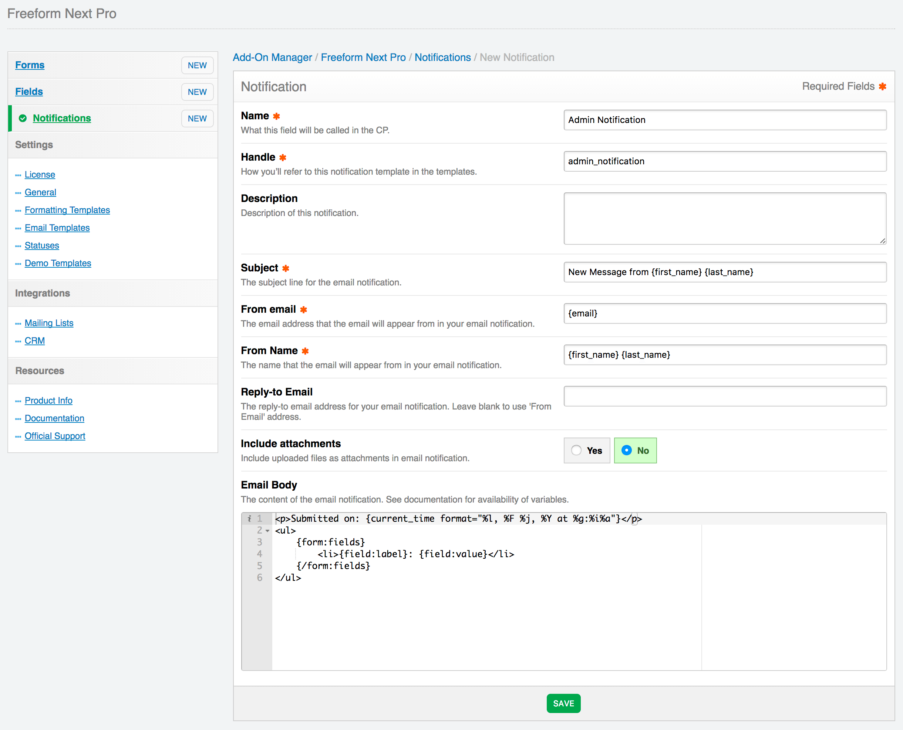

# Email Notifications

Freeform allows you to send HTML email notifications upon submittal of a form. They are global and can be reused for multiple forms, saving you time when you are managing many forms. They can be created and customized at **Freeform > Email Notifications**, as well as directly at form level within Composer. Email notification templates that are created within Composer will contain basic default content and should be checked and updated once finished building your form.

Email notifications can be sent to email address(es) specified for admins (in the **Notify** section of Composer (right column) as well as email addresses specified/selected in the [Email](fields-field-types.md#fields-email) and [Dynamic Recipients](fields-field-types.md#fields-dynamic-recipients) field types. To assign an email notification template to these fields, click on the field in Composer, and then in the Property Editor (right column), select a notification template you want used to generate an email notification for the entered/selected email address.

<video width="100%" autoplay loop style="border-radius: 3px;">
	<source src="/documentation/craft/freeform/videos/freeform-notifications.mp4" type="video/mp4">
	Your browser does not support playing this video.
</video>

Email Notification templates contain the following options:

* **Name** <a href="#name" id="name" class="docs-anchor">#</a>
	* A common name for the notification template to identify it easier.
* **Handle** <a href="#handle" id="handle" class="docs-anchor">#</a>
	* The unique identifier for the notification template, used when in your regular templates when specifying a notification template.
* **Description** <a href="#description" id="description" class="docs-anchor">#</a>
	* A description for the notification template to help identify what it's used for, etc.
* **Subject** <a href="#subject" id="subject" class="docs-anchor">#</a>
	* The subject line for the email notification.
		* Can include any Freeform field variables (`{{ fieldName }}`) as well as `{{ form.name }}`.
* **From Email** <a href="#from-email" id="from-email" class="docs-anchor">#</a>
	* The email address the email notification will appear from.
		* Can include any Freeform field variable (`{{ fieldName }}`).
			* **NOTE:** Using dynamic approach with a variable could have your emails marked as spam.
* **From Name** <a href="#from-name" id="from-name" class="docs-anchor">#</a>
	* The email address the email notification will appear from.
		* Can include any Freeform field variables (`{{ fieldName }}`).
			* Ex: `{{ firstName }} {{ lastName }}`
			* **NOTE:** Using dynamic approach with variables could have your emails marked as spam.
* **Reply-to Email** <a href="#replyto-email" id="replyto-email" class="docs-anchor">#</a>
	* The email address the email notification will has set for Reply-to.
		* Can include any Freeform field variable (`{{ fieldName }}`).
			* **NOTE:** Using dynamic approach with a variable could have your emails marked as spam.
		* Leave blank to use the **From Email** address.
* **Include Attachments** <a href="#include-attachments" id="include-attachments" class="docs-anchor">#</a>
	* Include uploaded files as attachments in email notification.
* **Email Body** <a href="#email-body" id="email-body" class="docs-anchor">#</a>
	* The HTML body of the email notification to be sent.
		* Can include any Freeform field variable (`{{ fieldName }}`) as well as `{{ form.name }}`, `{{ form.id }}`, `{{ form.handle }}` and `{{ dateCreated }}`.
			* Available field options:
				* `{{ fieldName.label }}` - displays the label (name) of the field.
				* `{{ fieldName.valueAsString }}` - displays the option label(s) submitted.
					* Example: `Apples`
					* Array of data example: `Apples, Oranges`
				* `{{ fieldName.getValueAsString(false) }}` - displays the option value(s) submitted.
					* Example: `apples`
					* Array of data example: `apples, oranges`
					* Avoid using `{{ fieldName.value }}`, as it may not be a string and could trigger an error.
				* `{{ fieldName.instructions }}` - displays the instructions for the field.
				* `{{ fieldName.handle }}` - displays the handle of the field.
				* `{{ fieldName.placeholder }}` - displays the placeholder of the field.
		* Can also use `allFields` variable to automate parsing of fields.
			* Will only parse fields that contain data.
			* Available fields:
				* `{{ field.label }}` - displays the label (name) of the field.
				* `{{ field.valueAsString }}` - displays the option label(s) submitted.
					* Example: `Apples`
					* Array of data example: `Apples, Oranges`
				* `{{ field.getValueAsString(false) }}` - displays the option value(s) submitted.
					* Example: `apples`
					* Array of data example: `apples, oranges`
					* Avoid using `{{ field.value }}`, as it may not be a string and could trigger an error.
				* `{{ field.instructions }}` - displays the instructions for the field.
				* `{{ field.handle }}` - displays the handle of the field.
				* `{{ field.placeholder }}` - displays the placeholder of the field.

## Examples <a href="#examples" id="examples" class="docs-anchor">#</a>

Below is a basic automated example:

	
The following submission came in on{{ dateCreated|date('l, F j, Y \\a\\t g:ia') }}.

	
Here are the details:

	<ul>
	
		<li>{{ field.label }}: {{ field.valueAsString }}</li>
	
	</ul>

---

Below is a manually built example:

	
The following submission came in on {{ dateCreated|date('l, F j, Y \\a\\t g:ia') }}.

	
Here are the details:

	<ul>
		<li>Name: {{ firstName }} {{ lastName }}
		<li>Email: {{ email }}
		<li>Home Phone: {{ homePhone }}
		<li>Cell Phone: {{ cellPhone }}
		<li>
			Services interested in:
			<ul>
			
				<li>{{ value }}</li>
			
			</ul>
		</li>
		<li>
			Message: 
			{{ message }}
		</li>
	</ul>

---

You can also have your notification email template code iterate over submission values (as long as you're [storing submitted data](forms-composer.md#submission-store-data)) like this:

	
		<h4>{{ submission.id }}: {{ submission.title }}</h4>
		<ul>
		
			<li>{{ field.label }}: {{ attribute(submission, field.handle) }}</li>
		
		</ul>
	
