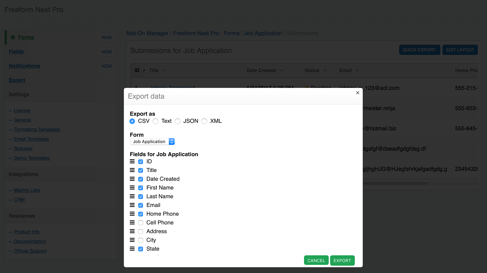
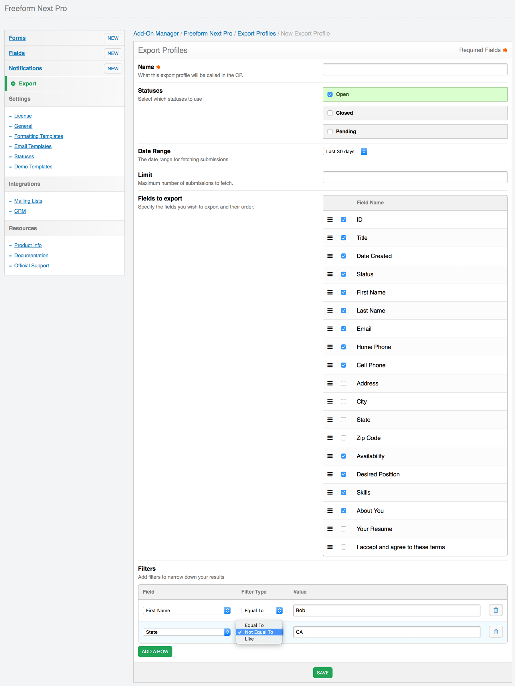
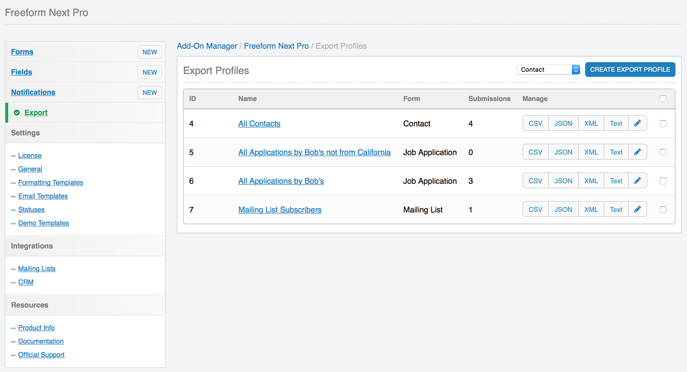

# Exporting

Freeform includes 3 options for exporting (2 of which are Pro only):

* [Quick Export (Pro)](#quick-export)
* [Export Profiles (Pro)](#export-profiles)
* [Basic CSV Export](#basic-csv)

## Quick Export (Pro) <a href="#quick-export" id="quick-export" class="docs-anchor">#</a>

Freeform Pro's Quick Export feature displays inside the Submissions page of the Freeform control panel. Clicking the *Quick Export* button at the top of the page allows you to export all submissions for a given form, in your choice of **CSV**, **Text**, **JSON** or **XML**. You can then exclude whichever fields you don't want exported.

## Export Profiles (Pro) <a href="#export-profiles" id="export-profiles" class="docs-anchor">#</a>

Freeform Pro's Export Profiles feature allows admins to create more complex pre-defined export profiles that can be run by any user with proper permissions at any time. Options for export profiles are as follows:

* **Name**
	* Create an intuitive name of the profile that is easy for your clients / administrators to figure out.
* **Statuses**
	* Select which statuses, if any, to filter the results by.
* **Date Range**
	* Select a date range, if any, you want the results limited by. Current options are:
		* None
		* Today
		* Yesterday
		* Last 7 days
		* Last 30 days
		* Last 365 days
* **Limit**
	* Maximum number of submissions the export should generate.
* **Fields to Export**
	* Select the fields you'd like to be included and rearrange their order.
* **Filters**
	* Add filters to narrow down your results.
	* Select a field name and check if it's **Equal to** / **Not equal to** / **Like** a value specified.
	* Specify as many filters as you wish.

Once export profile(s) exist users can export submissions in their choice of **CSV**, **Text**, **JSON** or **XML**.

## Basic CSV Export <a href="#basic-csv" id="basic-csv" class="docs-anchor">#</a>

The *Lite* and *Express* editions of Freeform include CSV exporting functionality.

To export all of your Freeform submissions:

* For the form you'd like to export, click on the submissions count in the **Submissions** column of the forms list.
* At the top right of the page, click the **Export CSV button**.
	* Currently you can only export ALL submissions.

For more advanced and flexible exporting options, consider [upgrading to Freeform Pro](https://solspace.com/expressionengine/freeform/#compare)!
