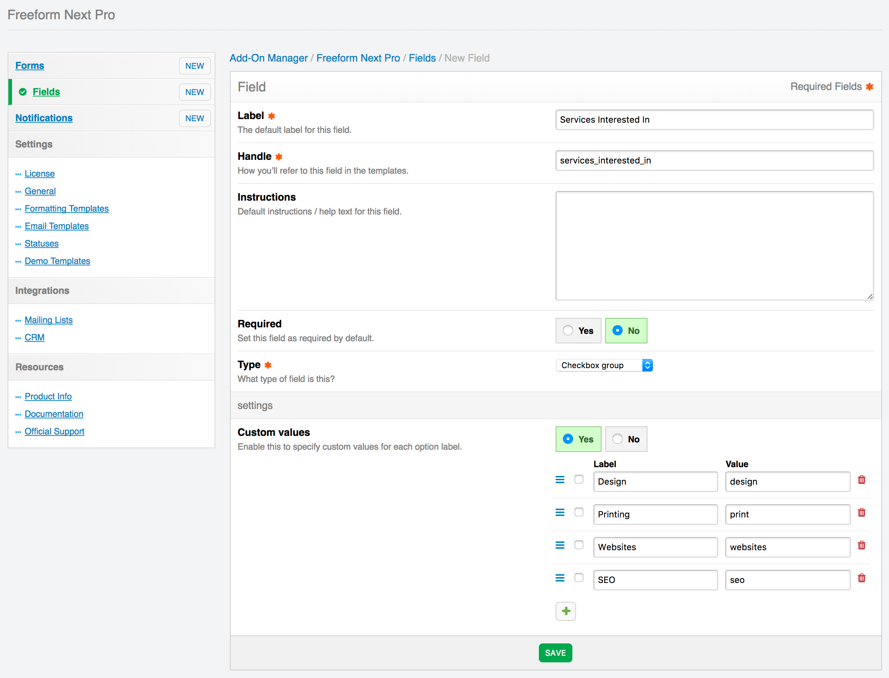
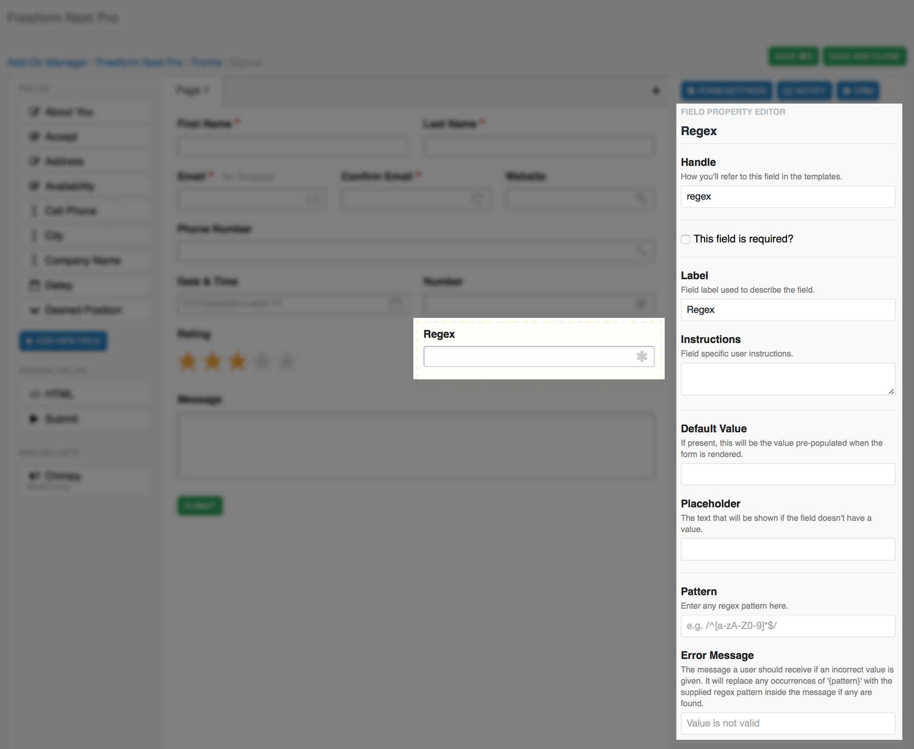

# Fields & Field Types

Freeform uses its own set of fields and field types. Using a predefined set of fields also gives us the control to more easily account for how each form field should be displayed in Composer's live preview, and provides a smoother experience.

**NOTE:** There is currently a limitation of 195 Freeform fields for each install of ExpressionEngine, due to the MySQL column limit, since all fields are stored in a single table. However, Freeform fields can be used across all forms, and even be relabelled for each form.

* [Fields Overview](#fields)
* [Field Types](#field-types)
* [Pro Field Types](#pro-field-types)


## Fields Overview <a href="#fields" id="fields" class="docs-anchor">#</a>

Fields are global and available to all forms, but they can also be overwritten per form. This allows you to save time reusing existing fields when making other forms, but also gives you flexibility to make adjustments to them when needed. So to clarify, you can create fields with labels and options that are common to all forms, but also override those on each form. For example, if you have a field named **Cell Phone**, on the form level, you can rename the field name to **Mobile Phone**, or if you have a Checkbox Group field with options: **Option 1**, **Option 2**, and **Option 3**, you could override it to just have 2 options with values of **Option A** and **Option B**. When the fields are edited at global level (in main Fields area of Freeform control panel), your customizations per form will NOT be lost.

Fields can be created and managed in the main field creation area (**Freeform Next > Fields > New Field**) and can also be created directly within the *Composer* interface as well. Fields created here are available globally as well (they do not just exist for that form).

Some important notes:

* All field properties can be overwritten at form level inside Composer, including the field Handle.
* Once a field is created, you cannot change the field type after.
* Freeform will load fields of [Hidden](#fields-hidden) type at the beginning of the form, regardless of where they are placed in Composer layout.

[](images/cp_fields-list.png)

[](images/cp_fields-create.png)


## Field Types <a href="#field-types" id="field-types" class="docs-anchor">#</a>

The following field types are available ([see below for additional Pro Field Types](#pro-field-types)):

* **Text** (`text`) <a href="#fields-text" id="fields-text" class="docs-anchor">#</a>
	* A simple input field.
		* Can be marked as required.
		* Can contain default text and/or placeholder.
* **Textarea** (`textarea`) <a href="#fields-textarea" id="fields-textarea" class="docs-anchor">#</a>
	* A simple multi-line input field.
		* Specify the number of rows the textarea should have.
		* Can be marked as required.
		* Can contain default text and/or placeholder.
		* Will automatically convert newlines to line breaks when outputting data in templates or email notifications.
* **Email** (`email`) <a href="#fields-email" id="fields-email" class="docs-anchor">#</a>
	* An input field that is flagged in Freeform to expect an email address value as well as possibility for receiving email notifications.
		* In the Property Editor (right column) in Composer, select a notification template if you want the email entered for this field to receive an email notification.
		* To allow sending of email notifications to more than 1 email address (e.g. in the case of a "Tell-a-Friend" type form), you can add multiple input fields, each with the name `email[]`. This approach would require that you code this part manually however.
		* Required field type if you wish for your users to receive an email notification.
		* Required field type if you're using with a Mailing List API integration.
		* Can be marked as required.
		* Can contain default text and/or placeholder.
* **Hidden** (`hidden`) <a href="#fields-hidden" id="fields-hidden" class="docs-anchor">#</a>
	* A hidden field.
		* Can only include text strings at this time (no variables allowed).
			* If you need you pass a value to your hidden field dynamically, you can do so with the `override_values` parameter, e.g. `override_values:FIELD_NAME="myvalue"`
		* Cannot be marked as required.
		* Freeform will load fields of this type at the beginning of the form, regardless of where they are placed in Composer layout.
* **Select** (`select`) <a href="#fields-select" id="fields-select" class="docs-anchor">#</a>
	* A select dropdown menu field.
		* Can specify labels (with values assumed) or labels and values (that differ).
			* To make the first option empty, use **labels and values** approach with first option having **--** or **Please select...**, etc for the label, and leave option blank.
		* Can be marked as required.
		* Can specify default option to be selected.
* **Checkbox** (`checkbox`) <a href="#fields-checkbox" id="fields-checkbox" class="docs-anchor">#</a>
	* A single checkbox field.
		* Has a default value of **Yes**, which can be overwritten with any value you want. The front end however, will always display the value as `1`, but upon submission, the value will be switched to the one you have set.
		* Can be marked as required, which would essentially require that this checkbox be checked.
		* Can be checked by default.
* **Checkbox Group** (`checkbox_group`) <a href="#fields-checkbox-group" id="fields-checkbox-group" class="docs-anchor">#</a>
	* A group of checkboxes.
		* Can specify labels (with values assumed) or labels and values (that differ).
		* Can be marked as required.
		* Can specify which (if any) options to be checked by default.
* **Radio Group** (`radio_group`) <a href="#fields-radio-group" id="fields-radio-group" class="docs-anchor">#</a>
	* A group of radio options.
		* Can specify labels (with values assumed) or labels and values (that differ).
		* Can be marked as required.
		* Can specify which (if any) option to be selected by default.
* **File Upload** (`file`) <a href="#fields-file-upload" id="fields-file-upload" class="docs-anchor">#</a>
	* A single file upload field, using [EE File Uploads](https://docs.expressionengine.com/v3/add-ons/file/file_tag.html).
		* Must have an Upload Directory Preference where the file will be uploaded to.
		* Be sure that the EE Upload Directory's *Allowed file types?* preference is set to **All file types**, even if you're only using images.
		* Define maximum file size (in KB). Default is 2048 KB (2MB). Is subject to:
			* PHP [memory_limit](http://us3.php.net/manual/en/ini.core.php#ini.memory-limit)
			* PHP [post_max_size](http://us3.php.net/manual/en/ini.core.php#ini.post-max-size)
			* PHP [upload_max_filesize](http://us3.php.net/manual/en/ini.core.php#ini.upload-max-filesize)
		* Select which file types can be uploaded.
			* Leaving all options unchecked will allow ALL file types.
		* In [multi-page forms](multi-page-forms.md), if an earlier page contains file upload field(s), files will actually be uploaded before the form is officially submitted.
			* If the form is never completed, incomplete submissions are stored for 3hrs, and then are removed (along with the file(s)) after that.
		* Can be marked as required.
* **Dynamic Recipients** (`dynamic_recipients`) <a href="#fields-dynamic-recipients" id="fields-dynamic-recipients" class="docs-anchor">#</a>
	* A select dropdown menu field that contains protected email addresses and labels for each.
		* Can be switched to Radio options at form level inside Composer.
		* Specify labels and email address values.
			* Emails are never parsed in source code (they're replaced with **0**, **1**, **2**, etc).
				* **NOTE:** When parsing this field semi-manually, be sure to use `{field:index}` to generate numeric values of options instead of `{field:value}`.

					```<select name="{field:department:handle}" type="dynamic_recipients">
					{field:department:options}
						<option value="{option:index}" {if option:checked}selected{/if}>
							{option:label}
						</option>
					{/field:department:options}
					</select>```

			* To make the first option empty, specify **--** or **Please select...**, etc for the label, and leave option blank.
		* In the Property Editor (right column) in Composer, select a notification template you want the selected recipient for this field to receive.
			* Users/groups need to have permissions access for **Email Notifications** to create new formatting templates.
		* Can be marked as required.
		* Can specify default option to be selected.
		* Currently only 1 recipient can be selected at this time.
		* Can include more than 1 of this field type in your forms, allowing for multiple sets of recipients to be notified.


## Pro Field Types <a href="#pro-field-types" id="pro-field-types" class="docs-anchor">#</a>

The following extra field types are available with Freeform Next Pro:

* **Confirmation** <a href="#fields-confirmation" id="fields-confirmation" class="docs-anchor">#</a>
	* Allows you to force a user to enter a matching value for another field (e.g. "Confirm Email Address").
		* Select a target field to compare with.
		* Can be marked as required.
		* Can contain default text and/or placeholder.

[](images/cp_field-confirm.png)

* **Date & Time** <a href="#fields-date-time" id="fields-date-time" class="docs-anchor">#</a>
	* A complex date and/or time field. Can be used as Date only, Time only, or both. Many configuration and validation options available as well:
		* Set a default value.
			* Can use `now`, `today`, `5 days ago`, `2017-01-01 20:00:00`, etc, which will format the default value according to the chosen format as a localized value.
		* Select if the field should use the default Freeform datepicker.
			* Can include your own manually in the template if you wish.
		* Generate a placeholder from your date format settings showing the accepted format.
			* Can include your own placeholder if you wish.
		* Date Order - the formatting order you'd like. Options are:
			* Year month day
			* Month day year
			* Day month year
		* Select if the year should be displayed/validated as 4 digits.
		* Select if the day and month numbers should have a leading `0` for single digit values (e.g. August will display as `08` instead of `8`).
		* Date separator - the character used between each year, month, day value:
			* None
			* Space (` `)
			* `/`
			* `-`
			* `.`
		* Select if time and datepicker should use 24 hour clock.
		* Clock separator - the character used to separate hours and minutes:
			* None
			* Space (` `)
			* `:`
			* `-`
			* `.`
		* Choose if placeholder should display lowercase AM/PM (for 12hr clock).
		* Choose if placeholder should separate AM/PM with a space (for 12hr clock).
		* Can be marked as required.

[](images/cp_field-datetime.png)

* **Number** <a href="#fields-number" id="fields-number" class="docs-anchor">#</a>
	* An input field that is validated to contain numbers only, based on several configuration options.
		* Choose if validation should allow negative numbers.
		* Optionally set Min/Max values.
			* Both are optional, you can have both, just one or neither.
		* Optionally set Min/Max character length.
			* Both are optional, you can have both, just one or neither.
		* Set the number of decimals allowed.
		* Decimal Separator - the character used to separate decimals:
			* `.`
			* `,`
		* Thousands Separator - the character used to separate thousands:
			* None
			* Space (` `)
			* `,`
			* `.`
		* Can be marked as required.
		* Can contain default text and/or placeholder.

[](images/cp_field-number.png)

* **Phone** <a href="#fields-phone" id="fields-phone" class="docs-anchor">#</a>
	* An input field that is validated to contain phone numbers only, based on pattern configured.
		* Set pattern to desired format, where `x` is a digit between `0` and `9`, e.g:
			* `(xxx) xxx xxxx`
			* `xxx-xxx-xxxx`
			* If no pattern specified, Freeform will default to a universal phone number validation pattern.
		* Can be marked as required.
		* Can contain default text and/or placeholder.

[](images/cp_field-phone.png)

* **Rating** <a href="#fields-rating" id="fields-rating" class="docs-anchor">#</a>
	* A special field that allows for star ratings using Freeform's built in CSS and JS.
		* Set a default star rating value (based on Maximum Number of Stars configuration option)
		* Set the maximum number of stars allowed.
		* Select an "Unselected" display color.
		* Select a "Hover" display color.
		* Select a "Selected" display color.
		* Can be marked as required.

[](images/cp_field-rating.png)

* **Regex** <a href="#fields-regex" id="fields-regex" class="docs-anchor">#</a>
	* An input field that is validated based on the specified regex pattern (e.g. `/^[a-zA-Z0-9]*$/`).
		* Set error message a user will see if an incorrect value is supplied.
			* Any occurrences of `{{pattern}}` will be replaced with specified regex pattern inside the error message, if any are found.
		* Can be marked as required.
		* Can contain default text and/or placeholder.

[](images/cp_field-regex.png)

* **Website** <a href="#fields-website" id="fields-website" class="docs-anchor">#</a>
	* A simple input field that checks to see if the URL specified has valid syntax (`http://`, `https://`, `ftp://`, etc).
		* Can be marked as required.
		* Can contain default text and/or placeholder.

[](images/cp_field-website.png)
