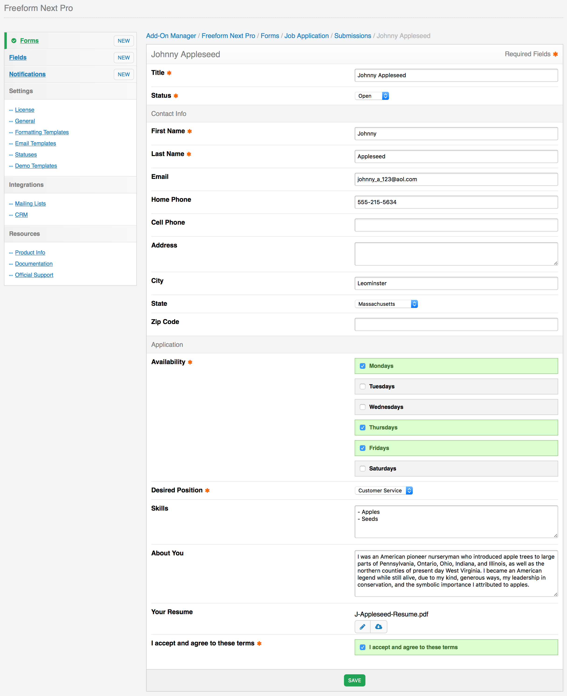

# Submissions

Similar to Channel Entries, every time a user submits a form, we refer to those as submissions. Currently, submissions can be viewed and edited in the control panel, and displayed on the front end in templates as a list and individually.

## In the Control Panel <a href="#control-panel" id="control-panel" class="docs-anchor">#</a>

Each form contains it's own grouping of submissions. You can view these by clicking on the submissions count in the **Submissions** column of the forms list. When presented the list of submissions, you can adjust which field columns are shown, and click into any of the submissions to edit them.

## Exporting Submissions <a href="#exporting" id="exporting" class="docs-anchor">#</a>

Freeform includes 3 options for exporting (2 of which are Pro only). Please refer to the [Exporting](exporting.md) documentation for more information.

## In Front End Templates <a href="#templates" id="templates" class="docs-anchor">#</a>

One common use-case might be displaying the contents of the form submission to the user that submitted it right after they have successfully submitted the form, allowing them to review what they submitted. Of course, be aware that there are security implications here if the submissions contain sensitive content.

If the information is not sensitive, and meant to be public - like comments, you can also display submissions in a paginated (or not) list.

For more information about this, please visit the [Freeform_Next:Submissions](submissions.md) template tag documentation.
