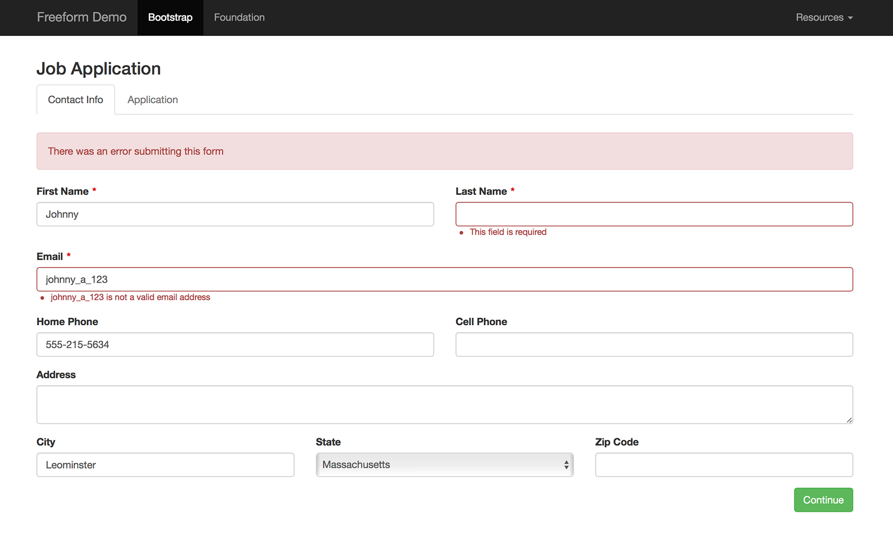

# Freeform_Next:Form tag

The *Freeform_Next:Form* template tag displays your form contents. You can either loop through automated rendering of form pages/rows/columns/fields (based on what is in Composer), or manually enter each field if you need full control for complex forms.

If you're wanting to simply render a complete form based on Composer layout and the assigned formatting template, you can just use the [Freeform_Next:Render](#render-examples) template tag (all of the same parameters below are available for it).

[](images/templates_form-errors.png)

* [Parameters](#parameters)
* [Variables](#variables)
* [Variable Pairs](#variable-pairs)
* [Conditionals](#conditionals)
* [Examples](#examples)


## Parameters <a href="#parameters" id="parameters" class="docs-anchor">#</a>

* `form` <a href="#param-form" id="param-form" class="docs-anchor">#</a>
	* Specify the handle of the form you'd like to be displayed.
* `form_id` <a href="#param-form-id" id="param-form-id" class="docs-anchor">#</a>
	* Specify the ID of the form you'd like to be displayed.
* `input_class` <a href="#param-inputclass" id="param-inputclass" class="docs-anchor">#</a>
	* Overrides the class name of all input elements.
* `submit_class` <a href="#param-submitclass" id="param-submitclass" class="docs-anchor">#</a>
	* Overrides the class name of all submit elements.
* `row_class` <a href="#param-rowclass" id="param-rowclass" class="docs-anchor">#</a>
	* Overrides the class name of all row `<div>` elements.
* `column_class` <a href="#param-columnclass" id="param-columnclass" class="docs-anchor">#</a>
	* Overrides the class name of all field column `<div>` elements.
* `label_class` <a href="#param-labelclass" id="param-labelclass" class="docs-anchor">#</a>
	* Overrides the class name of all `<label>` elements.
* `error_class` <a href="#param-errorclass" id="param-errorclass" class="docs-anchor">#</a>
	* Overrides the class name of all error `<ul>` elements.
* `instructions_class` <a href="#param-instructionsclass" id="param-instructionsclass" class="docs-anchor">#</a>
	* Overrides the class name of all instruction `<div>` elements.
* `instructions_below_field` <a href="#param-instructionsbelowfield" id="param-instructionsbelowfield" class="docs-anchor">#</a>
	* If set to `yes` - will render field instructions below the `<input>` element.
* `class` <a href="#param-class" id="param-class" class="docs-anchor">#</a>
	* Overrides the `<form>` class name.
* `id` <a href="#param-id" id="param-id" class="docs-anchor">#</a>
	* Overrides the `<form>` ID attribute.
* `return_url` or `return` <a href="#param-returnurl" id="param-returnurl" class="docs-anchor">#</a>
	* Overrides the return URL (set inside Composer) for the form.
	* Use `SUBMISSION_ID` to generate the future submission ID in the return URL.
* `method` <a href="#param-method" id="param-method" class="docs-anchor">#</a>
	* Overrides the `<form>` method attribute. `POST` by default.
* `name` <a href="#param-name" id="param-name" class="docs-anchor">#</a>
	* Overrides the `<form>` name attribute.
* `action` <a href="#param-action" id="param-action" class="docs-anchor">#</a>
	* Overrides the `<form>` action attribute.
* `override_values` <a href="#param-overridevalues" id="param-overridevalues" class="docs-anchor">#</a>
	* Allows overriding the default values for any field:
		* Specify the field `handle` and provide the custom value override as its value.
		* E.g. `override_values:location="{segment_3}"`.
		* If a field uses an `override_value` attribute, it will take precedence over the value specified in this attribute.
* `form_attributes` <a href="#param-formattributes" id="param-formattributes" class="docs-anchor">#</a>
	* Attributes which will be added to the form.
	* E.g. `form_attributes:novalidate="true"`, `form_attributes:data-form-id="test"`
	* To achieve something like `<form novalidate>`, just specify `form_attributes:novalidate` instead of `form_attributes:novalidate="true"`.
* `input_attributes` <a href="#param-inputattributes" id="param-inputattributes" class="docs-anchor">#</a>
	* Attributes which will be added to all input fields.
	* E.g. `input_attributes:readonly="true"`, `input_attributes:data-field-id="test"`
* `use_required_attribute="yes"` <a href="#param-userequiredattribute" id="param-userequiredattribute" class="docs-anchor">#</a>
	* Adds `required` attribute to input fields that have been set to be required in Composer.
* `dynamic_notification_recipients` <a href="#param-dynamicnotificationrecipients" id="param-dynamicnotificationrecipients" class="docs-anchor">#</a>
	* Allows using a dynamic template level notification for a more fine-grained control.
	* Hard code values or pass a value from a channel entry, etc, e.g. `dynamic_notification_recipients="admin@example.com|support@example.com"`
	* **REQUIRED:** Use with `dynamic_notification_template="test.html"` parameter to specify the notification template to be used.
		* For Database entry based templates, specify the handle name.
		* For HTML file based templates, specify the full file name including **.html**.
* `no_form_tags` <a href="#param-noformtags" id="param-noformtags" class="docs-anchor">#</a>
	* Specify a value of `yes` to prevent the `<form>` tags from rendering.
	* Helpful in some scenarios where you might be using the *Freeform_Next:Form* template tag to render some field data, such as a table header for Submissions list (see demo templates).


## Variables <a href="#variables" id="variables" class="docs-anchor">#</a>

* `{form:name}` <a href="#var-name" id="var-name" class="docs-anchor">#</a>
	* Outputs the name of the form.
* `{form:handle}` <a href="#var-handle" id="var-handle" class="docs-anchor">#</a>
	* Outputs the handle of the form.
* `{form:id}` <a href="#var-id" id="var-id" class="docs-anchor">#</a>
	* Outputs the unique ID of the form.
* `{form:description}` <a href="#var-description" id="var-description" class="docs-anchor">#</a>
	* Outputs the description of the form.
* `{form:return_url}` <a href="#var-returnUrl" id="var-returnUrl" class="docs-anchor">#</a>
	* Outputs the return URL of the form.
* `{form:current_page}` <a href="#var-currentpage" id="var-currentpage" class="docs-anchor">#</a>
	* Returns the current page containing its label and index.
* **Custom Attributes** <a href="#var-custom-attributes" id="var-custom-attributes" class="docs-anchor">#</a>
	* The following variables are available to help with formatting, based on what you have specified in Composer or the corresponding parameters:
		* `{form:id_attribute}` <a href="#var-custattr-id" id="var-custattr-id" class="docs-anchor">#</a>
			* The ID attribute of the HTML form tag.
		* `{form:class}` <a href="#var-custattr-class" id="var-custattr-class" class="docs-anchor">#</a>
			* The CLASS attribute of the HTML form tag.
		* `{form:method}` <a href="#var-custattr-method" id="var-custattr-method" class="docs-anchor">#</a>
			* The METHOD attribute for the form tag.
		* `{form:action}` <a href="#var-custattr-action" id="var-custattr-action" class="docs-anchor">#</a>
			* The ACTION attribute for the form tag.
		* `{form:row_class}` <a href="#var-custattr-rowclass" id="var-custattr-rowclass" class="docs-anchor">#</a>
			* The CLASS attribute of all HTML row tags.
		* `{form:column_class}` <a href="#var-custattr-columnclass" id="var-custattr-columnclass" class="docs-anchor">#</a>
			* The CLASS attribute of all HTML column tags.
* `{column:grid_width}` <a href="#var-column_grid_width" id="var-column_grid_width" class="docs-anchor">#</a>
	* Outputs the grid width (out of 12) for the column that contains the field. Aids with setting up responsive template.
* `{column:count}` <a href="#var-column_count" id="var-column_count" class="docs-anchor">#</a>
	* Outputs the total number of columns (fields) for the row.
* `{column:index}` <a href="#var-column_index" id="var-column_index" class="docs-anchor">#</a>
	* Outputs the column number for specific column (field) of that row, e.g. `0`, `1`, `2`, `3`.
* **Manual Fields** <a href="#var-fieldname" id="var-fieldname" class="docs-anchor">#</a>
	* You can manually construct forms with any Freeform field variable, using the proper syntax:
		* `{field:field_name:label}` - displays the label (name) of the field.
		* `{field:field_name:value}` - displays the option label(s) submitted (for form reloading upon submit error).
		* `{field:field_name:handle}` - displays the handle of the field.
		* `{field:field_name:placeholder}` - displays the placeholder of the field (when applicable).
		* `{field:field_name:options}{/field:field_name:options}` - variable pair that helps render fields with multiple options like select fields, etc.
			* `{option:value}` - the option value for the field option.
			* `{option:label}` - the option label for the field option.
			* `{if option:checked}selected{/if}` - check if the field option is selected/checked.
			* Example code would look something like this:
				```
				<select name="{field:state:handle}">
					{field:state:options}
					<option value="{option:value}" {if option:checked}selected{/if}>
						{option:label}
					</option>
					{/field:state:options}
				</select>
				```
	* Also available are automated rendering options for manually constructed forms:
		* `{field:field_name:render}` - renders complete field (label, input, etc). The following override parameters are available:
			* `id`
			* `class`
			* `label_class`
			* `error_class`
			* `instructions_class`
			* `instructions_below_field="1"`
			* `input_attributes`
				* Attributes to be added to the input field, e.g. `input_attributes:readonly="true"`, `input_attributes:data-field-id="test"`
			* `override_value`
				* Override the value for the input field, e.g. `override_value="test"`
		* `{field:field_name:render_label}` - renders the complete label. The following override parameters are available:
			* `label_class`
		* `{field:field_name:render_input}` - renders the complete input. The following override parameters are available:
			* `input_class`
			* `input_attributes`
				* Attributes to be added to the input field, e.g. `input_attributes:readonly="true"`, `input_attributes:data-field-id="test"`
			* `override_value`
				* Override the value for the input field, e.g. `override_value="test"`
		* `{field:field_name:render_instructions}` - renders the instructions. The following override parameters are available:
			* `instructions_class`
		* `{field:field_name:render_errors}` - renders the errors. The following override parameters are available:
			* `errors_class`
	* For a more robust automated rendering of fields, see the [{fields}{/fields}](#varpair-fields) variable pair.


## Variable Pairs <a href="#variable-pairs" id="variable-pairs" class="docs-anchor">#</a>

* `{pages}{/pages}` <a href="#varpair-pages" id="varpair-pages" class="docs-anchor">#</a>
	* Handles formatting options for displaying list of pages for multi-page forms.
		* `{page:index}` - page number
		* `{page:label}` - name of the page (set in Composer)
		* `{current_page:index}` - page number of currently viewed page
		* `{form:page_count}` - total number of pages for the form
	* Typical usage looks something like this:
		```
		{if form:page_count > 1}
			<ul class="nav nav-tabs">
			{pages}
				<li class="{if page:index == current_page:index}active{if:else}disabled{/if}">
					<a href="javascript:;">{page:label}</a>
				</li>
			{/pages}
			</ul>
		{/if}
		```
* `{rows}{/rows}` <a href="#varpair-rows" id="varpair-rows" class="docs-anchor">#</a>
	* Handles formatting options for displaying rows of fields in layout (set by Composer).
* `{fields}{/fields}` <a href="#varpair-fields" id="varpair-fields" class="docs-anchor">#</a>
	* Handles formatting options for displaying columns of fields in layout (set by Composer).
	* Not required if rendering a form manually.
	* The following variables and variable pairs are available for use when rendering your form:
		* `{field:label}` - label of field, e.g. `First Name`
		* `{field:handle}` - handle for field, e.g. `first_name`
		* `{field:instructions}` - instructions for field, e.g. `Please select from the following`
		* `{field:placeholder}` - placeholder for field (where applicable), e.g. `you@yourdomain.com`
		* `{field:type}` - type of field:
			* `text`
			* `textarea`
			* `hidden`
			* `select`
			* `checkbox`
			* `checkbox_group`
			* `radio_group`
			* `email`
			* `dynamic_recipients`
			* `file`
			* `mailing_list`
			* `html`
			* `submit`
			* `confirmation` (Pro)
			* `datetime` (Pro)
			* `phone` (Pro)
			* `rating` (Pro)
			* `regex` (Pro)
			* `website` (Pro)
		* `{field:required}` - renders as `1` if field is set to be required. Used as a conditional.
		* `{field:options}{/field:options}` - variable pair for formatting options for multi-option fields.
			* `{option:label}` - label of option, e.g. `California`
			* `{option:value}` - value of the option, e.g. `CA`
			* `{option:checked}` - renders as `1` if the option should be checked. Used as a conditional.
			* `{option:index}` - the order number of the option, e.g. `4`
		* `{field:show_as_radio}` - specific to Dynamic Recipients fieldtype.
		* `{field:position}` - positioning of field (submit fields), e.g. `submit-align-left`
	* Also available are automated rendering options:
		* `{field:render}` - renders complete field (label, input, etc). The following override parameters are available:
			* `id`
			* `class`
			* `label_class`
			* `error_class`
			* `instructions_class`
			* `instructions_below_field="1"`
			* `input_attributes`
				* Attributes to be added to the input field, e.g. `input_attributes:readonly="true"`, `input_attributes:data-field-id="test"`
			* `override_value`
				* Override the value for the input field, e.g. `override_value="test"`
		* `{field:render_label}` - renders the complete label. The following override parameters are available:
			* `label_class`
		* `{field:render_input}` - renders the complete input. The following override parameters are available:
			* `input_class`
			* `input_attributes`
				* Attributes to be added to the input field, e.g. `input_attributes:readonly="true"`, `input_attributes:data-field-id="test"`
			* `override_value`
				* Override the value for the input field, e.g. `override_value="test"`
		* `{field:render_instructions}` - renders the instructions. The following override parameters are available:
			* `instructions_class`
		* `{field:render_errors}` - renders the errors. The following override parameters are available:
			* `errors_class`


## Conditionals <a href="#conditionals" id="conditionals" class="docs-anchor">#</a>

* `{if form:no_results}{/if}` <a href="#cond-no-results" id="cond-no-results" class="docs-anchor">#</a>
	* Displays its contents when there are no results found for this template tag with the given set of parameters.
* `{if form:has_errors}{/if}` <a href="#cond-has-errors" id="cond-has-errors" class="docs-anchor">#</a>
	* Displays its contents when there are errors after attempting to submit the form.
* `{if form:is_submitted_successfully}{/if}` <a href="#cond-submitted-successfully" id="cond-submitted-successfully" class="docs-anchor">#</a>
	* Session success flash message.
	* Displays only once after a form is successfully submitted.


## Example Usage in Templates <a href="#examples" id="examples" class="docs-anchor">#</a>

Below shows a variety of approaches available to render your forms. For more complete examples for use with front-end frameworks like *Bootstrap*, see the [Formatting Template Examples documentation](formatting-template-examples.md).

<a name="render-examples"></a>
Render the form using its **formatting template** with the *Render* template tag:

	{exp:freeform_next:render form="contact_form"}

---

Render the form using its **formatting template**, but overriding some classes with the *Render* template tag:

	{exp:freeform_next:render
		form="contact_form"
		label_class="form-label"
		input_class="form-control"
		instructions_below_field="yes"
		submit_class="btn btn-success"
		override_values:location="{segment_3}"
	}
		{if form:no_results}Sorry, no form was found.{/if}
	{/exp:freeform_next:render}

---

Render a form automatically with some control on formatting:

	{exp:freeform_next:form
		form="contact_form"
		return_url="{path='about/contact'}"
		id="myform"
		class="form-class"
		row_class="sample-row-class"
		submit_class="button"
	}

		{if form:page_count > 1}
			<ul class="freeform-pages">
			{pages}
				<li>
				{if page:index == current_page:index}
					<a href="javascript:;">{page:label}</a>
				{if:else}
					{page:label}
				{/if}
				</li>
			{/pages}
			</ul>
		{/if}

		{if form:has_errors}
			<div class="freeform-form-has-errors">
				There was an error submitting this form
			</div>
		{/if}

		{rows}
			<div class="freeform-row {form:row_class}">
			{fields}
				<div class="freeform-column {form:column_class}{if field:type == 'submit'} freeform-column-content-align-{field:position}{/if}">
					{field:render
						class="{if field:type != 'submit'}freeform-input{/if}"
						label_class="freeform-label{if field:required} freeform-required{/if}{if field:input_only} freeform-input-only-label{/if}"
						error_class="freeform-errors"
						instructions_class="freeform-instructions"
					}
				</div>
			{/fields}
			</div>
		{/rows}

	{/exp:freeform_next:form}

---

Here is a more complex form (made to work with Bootstrap):

	<style>label.required:after {content:"\*";color:#d00;margin-left:5px;}.submit-align-left{text-align:left}.submit-align-right{text-align:right}.submit-align-center{text-align:center}.submit-align-center button:not(:first-of-type),.submit-align-left button:not(:first-of-type),.submit-align-right button:not(:first-of-type){margin-left:5px}.submit-align-spread button:first-child{float:left}.submit-align-spread button:last-child{float:right}</style>

	{exp:freeform_next:form
		form="contact_form"
		return_url="{path='about/contact'}"
	}

		{if form:page_count > 1}
			<ul class="nav nav-tabs">
			{pages}
				<li class="{if page:index == current_page:index}active{if:else}disabled{/if}">
					<a href="javascript:;">{page:label}</a>
				</li>
			{/pages}
			</ul>
		{/if}

		{if form:has_errors}
			<div class="alert alert-danger">
				There was an error submitting this form
			</div>
		{/if}

		{rows}
			<div class="row {form:row_class}">
			{fields}
				<div class="{form:column_class} col-xs-12 col-lg-{column:grid_width} {if field:type == 'checkbox' OR field:type == 'mailing_list'}checkbox{if:else}form-group{/if}{if field:has_errors} has-error{/if}{if field:type == 'submit'} submit-align-{field:position}{/if}">
				{if field:type == 'checkbox_group'}

					{field:render_label label_class="{if field:required}required{/if}"}

					{field:options}
						<div class="checkbox">
							<label>
								<input type="checkbox"
									name="{field:handle}[]"
									value="{option:value}"
									{if option:checked}checked{/if}
								/>
								{option:label}
							</label>
						</div>
					{/field:options}

					{field:render_instructions instructions_class="help-block"}
					{field:render_errors error_class="help-block"}

				{if:elseif field:type == 'radio_group' OR (field:type == 'dynamic_recipients' AND field:show_as_radio)}

					{field:render_label label_class="{if field:required}required{/if}"}

					{field:options}
						<div class="radio">
							<label>
								<input type="radio"
									name="{field:handle}"
									value="{option:value}"
									{if option:checked}checked{/if}
								/>
								{option:label}
							</label>
						</div>
					{/field:options}

					{field:render_instructions instructions_class="help-block"}
					{field:render_errors error_class="help-block"}

				{if:elseif field:type == 'submit'}

					{field:render}

				{if:else}

					{field:render
						class="{if field:type == 'checkbox' OR field:type == 'mailing_list'}checkbox{if:else}form-control{/if}"
						label_class="{if field:required}required{/if}"
						error_class="help-block"
						instructions_class="help-block"
						instructions_below_field="1"
					}

				{/if}
				</div>
			{/fields}
			</div>
		{/rows}

	{/exp:freeform_next:form}

---

<a name="manual-example"></a>
Form formatting can also be very manual or semi manual, if that is something you prefer. Here's an example of different levels of manual you can use:


	{exp:freeform_next:form
		form="contact_form"
		return_url="{path='about/contact'}"
	}

		{if form:is_submitted_successfully}
			{!-- Session success flash message - displays only once after a form is successfully submitted --}
			<div class="success">Form submitted successfully!</div>
		{/if}

		{if form:has_errors}
			<div class="error">There was an error submitting this form.</div>
		{/if}

		<h3>{form:name}</h3>

		<ul>
			<li>
				<label for="first_name">Name (required)</label>
				<input type="text" name="first_name" value="{field:first_name:value}" />
				<input type="text" name="last_name" value="{field:last_name:value}" />
				{field:first_name:render_errors error_class="field-error"}
				{field:last_name:render_errors error_class="field-error"}
			</li>
			<li>
				{field:email:render
					class="email-field"
					placeholder="you@youremail.com"
				}
			</li>
			<li>
				<label for="city">City</label>
				<input type="text" name="city" value="{field:city:value}" />
				{if field:city:render_errors}
					<div class="field-error">This field is required!</div>
				{/if}
			</li>
			<li>
				{field:state:label}
				{field:last_name:render_instructions instructions_class="field-instructions"}
		 		<select name="{field:state:handle}">
					{field:state:options}
					<option value="{option:value}" {if option:checked}selected{/if}>
						{option:label}
					</option>
					{/field:state:options}
				</select>
				{field:last_name:render_errors error_class="field-error"}
			</li>
			<li>
				{field:how_you_found_us:render}
			</li>
			<li>
				{field:department:label}
				<select name="{field:department:handle}" type="dynamic_recipients">
				{field:department:options}
					<option value="{option:index}" {if option:checked}selected{/if}>
						{option:label}
					</option>
				{/field:department:options}
				</select>
			</li>
			<li>
				<button type="submit">Submit</button>
			</li>
		</ul>

		{if form:no_results}
			<div class="error">This form does not exist.</div>
		{/if}

	{/exp:freeform_next:form}
