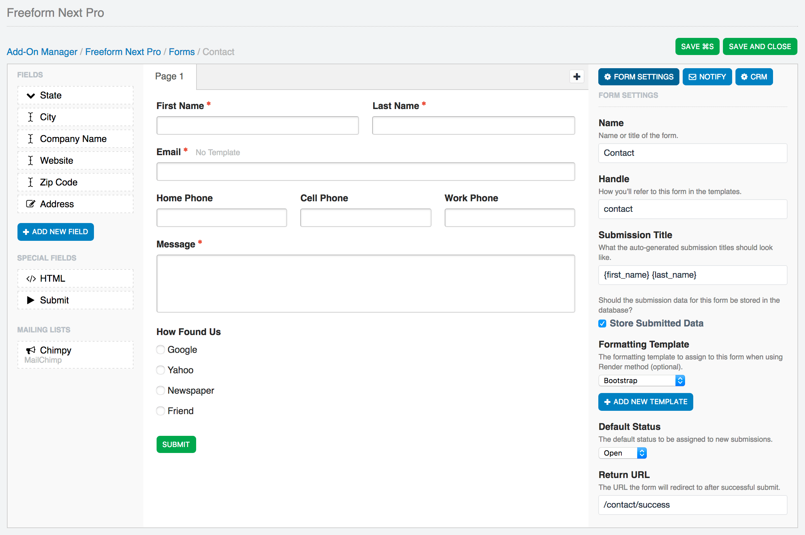
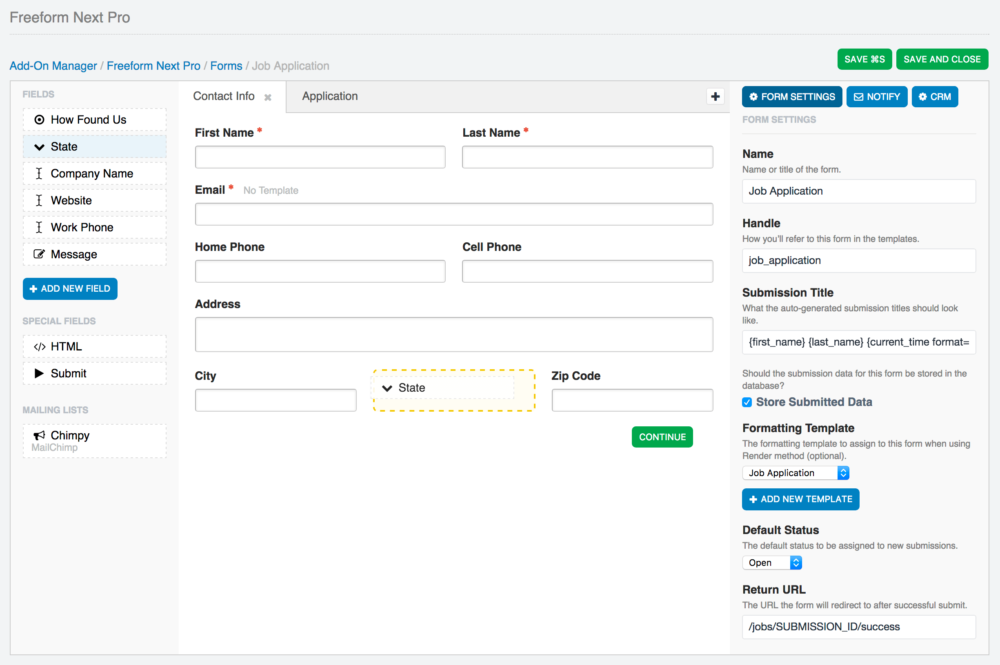
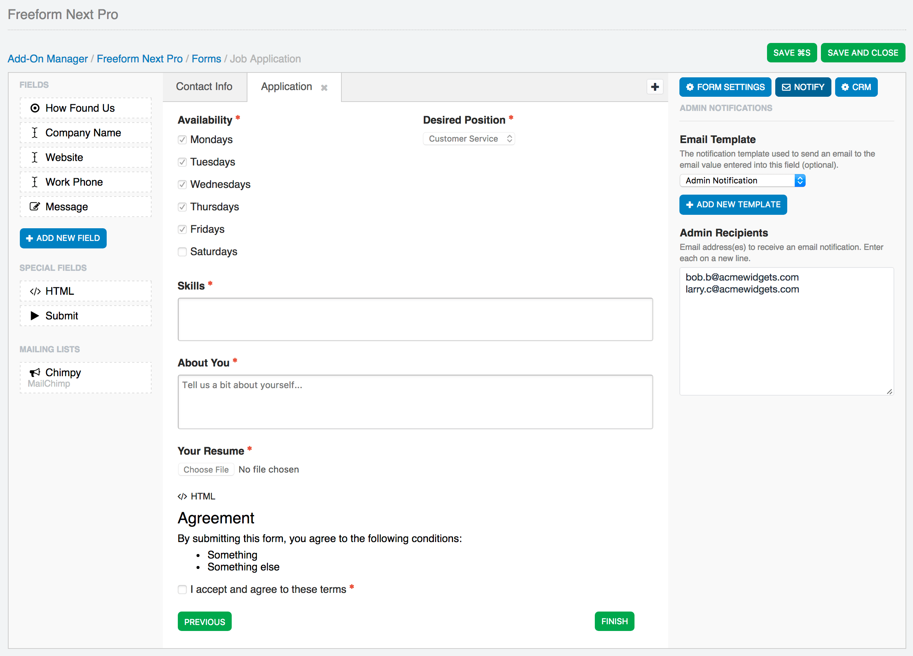
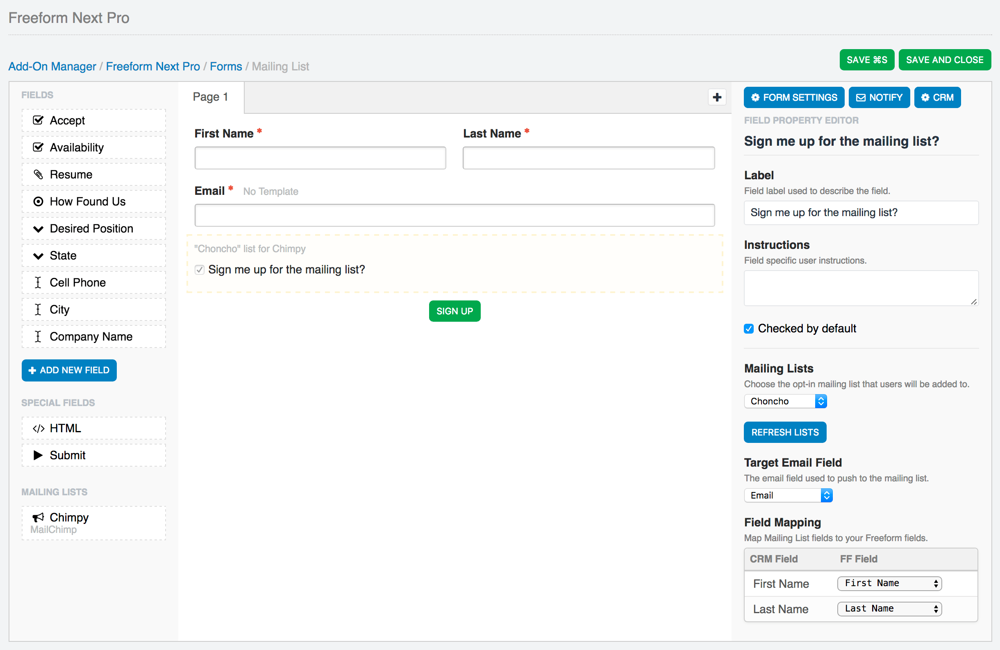
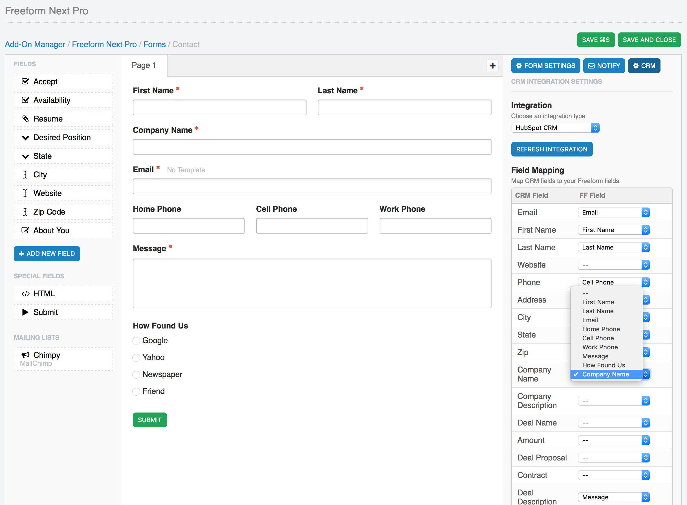

# Forms & Composer

What makes Freeform different from other form add-ons is that it includes a very intuitive, very interactive and very flexible interface for building forms. We call this, **Composer**. The *Freeform Express* edition has a limit of 1 form.

To create your first form, visit the Forms area of the Freeform control panel (**Freeform > Forms**), and then click the **New Form** button at the top right corner of the page.

The below documentation assumes that you have reviewed the [Fields & Field Types documentation](fields-field-types.md). If you have not already done so, start over there first.

## Composer <a href="#composer" id="composer" class="docs-anchor">#</a>

Freeform Composer is an all-in-one interface that lets you take control of almost every aspect of your forms. Everything is at your fingertips. Before we get started, here's a few notes about Composer:

* Composer is divided into 3 columns:
	* **Fields** (left column) contains all of the available fields you can add to your form.
	* **Layout** (center column) is where you actively see an interactive live preview of what your form will look like.
	* **Property Editor** (right column) is where all your configuration will happen. Clicking on any field, page tab or settings icon inside Composer layout area will load its configuration options here.
* Freeform Composer applies changes to fields instantly (no need to click save before you move on to adjust the next thing). We've also made the **Save*** button and **⌘S** option conveniently accessible for you.
* Fields, special fields and mailing lists are all drag and drop. Drag them on to add them. Drag them around to move them.
* Freeform Composer tries to handle as much work for you as possible. It will auto-split rows into columns to fit your fields beside each other, if you wish (to a maximum of 4 columns).
* As mentioned in the [Fields & Field Types documentation](fields-field-types.md), fields are global and available to all forms, but they can also be overwritten per form. This allows you to save time reusing existing fields when making other forms, but also gives you flexibility to make adjustments to them when needed.

More information about Computer features:

* [Form Settings](#form-settings)
* [Admin Email Notifications](#admin-notifications)
* [Fields (left column)](#fields)
* [Layout (center column)](#layout)
* [Property Editor (right column)](#property-editor)
* [Mailing List API Integrations](#form-mailing-list)
* [CRM API Integrations](#crm-integrations)

### Form Settings <a href="#form-settings" id="form-settings" class="docs-anchor">#</a>

When you first create a form, the Property Editor (right column) will display overall setting for your form. You can get back here to adjust these details at any time by clicking the **Form Settings** button at the top right of the **Property Editor** (right column) area.

* **Name** <a href="#form-name" id="form-name" class="docs-anchor">#</a>
	* A name for your form to identify it easier.
* **Handle** <a href="#form-handle" id="form-handle" class="docs-anchor">#</a>
	* The unique identifier for the form used in your regular templates calling the form.
* **Submission Title** <a href="#submission-title" id="submission-title" class="docs-anchor">#</a>
	* The variable(s) you place here will establish the title of each form submission to be displayed in the Submissions list.
		* Can include any Freeform field variables (`{field_name}`) as well as `{form:name}`, `{form:id}`, `{form:handle}` and `{date_created format="%l, %F %j, %Y at %g:%i%a"}`.
* **Store Submitted Data** <a href="#submission-store-data" id="submission-store-data" class="docs-anchor">#</a>
	* This setting allows you to specify whether the submission data for this form should be stored in the database or not.
		* Typical use-cases for not storing submission data on your site would be if you just wanted the [email notification](email-notifications.md) and/or wanted the data submitted over to a [Mailing List](mailing-list-integrations.md) or [CRM](crm-integrations.md) API.
* **Formatting Template** <a href="#formatting-template" id="formatting-template" class="docs-anchor">#</a>
	* Optional, if using the [Freeform_Next:Render](render.md) template tag, this essentially allows you to "attach" a formatting template to a form so that you don't need to include formatting inside the template(s) you place the form inside.
	* Select from an existing sample or custom template, or create a new one.
		* If creating a new one, a new template file will automatically be created for you in your [Form Template Directory](settings.md#form-template-directory) containing sample template code that you can adjust later.
* **Status** <a href="#form-status" id="form-status" class="docs-anchor">#</a>
	* The default status to be used when users submit the form, unless overwritten at template level.
	* See [Statuses documentation](settings.md#statuses) for managing statuses.
* **Return URL** <a href="#form-return-url" id="form-return-url" class="docs-anchor">#</a>
	* The URL that the form will redirect to after successful submit.
	* May contain `{form:handle}` and/or `{submission:id}` to parse the newly created unique submission ID in the URL. This would allow you to use the [Freeform_Next:Submissions](submissions.md) template tag to display some or all of the users' submission on the success page.
* **Description** <a href="#form-description" id="form-description" class="docs-anchor">#</a>
	* A description for the form to store notes or help identify what it's used for, etc.

### Admin Email Notifications <a href="#admin-notifications" id="admin-notifications" class="docs-anchor">#</a>

Freeform allows you to send an email to admins (or other predefined email addresses) 2 different ways:

* With the [Dynamic Recipients](fields-field-types.md#fields-dynamic-recipients) field type, allowing the user to select from a few different predefined options to direct their email notification to.
* As a hard coded option set for the form.

To use the latter approach, click the **Notify** button in the Property Editor (right column) to set up admin email notifications. Select the email notification template (or quickly create a new one - users/groups need to have permissions access for **Email Notifications** to create new notification templates), and then enter the admin email address(es), each on a new line, you wish to receive an email notification upon users successfully submitting the form.

### Fields (left column) <a href="#fields" id="fields" class="docs-anchor">#</a>

The left column displays a list of fields available for use. New fields can be created in the main field creation area (**Freeform > Fields > New Field**) as well as directly within the *Composer* interface by clicking the **Add New Field** button. Fields created here are available globally as well (they do not just exist for that form).

To use any fields, simply drag the field over to the **Layout** area (center column).

Special Fields include *HTML* and *Submit* button(s):

* **HTML** <a href="#form-html" id="form-html" class="docs-anchor">#</a>
	* Property Editor will load an HTML area for you to type or paste your code into.
	* Layout column will live parse your HTML.
	* All HTML is allowed here.
	* You can include as many of these in your form as you wish.
* **Submit** <a href="#form-submit" id="form-submit" class="docs-anchor">#</a>
	* Settings allow you to edit the button label.
	* You may adjust the positioning of the submit button:
		* Aligned to Left
		* Aligned to Center
		* Aligned to Right
	* When using with multi-page forms, Freeform will detect when you're on a page after first page, and provide you with additional options:
		* It will include a Previous button by default, allowing the user to go back to previous pages in the form.
			* Previous button can be disabled.
		* Positioning options now include:
			* Apart at Left and Right
			* Together at Left
			* Together at Center
			* Together at Right
	* You may include 1 per page in your form.

If you have configured a [Mailing List integration](mailing-list-integrations.md), you'll see a list for Mailing List integrations. There will be 1 displayed per connection, but you can include the mailing list sign up field as many times as you wish, as long as each uses a different list for that integration.

* **Mailing Lists** <a href="#form-mailing-list" id="form-mailing-list" class="docs-anchor">#</a>
	* Can only be displayed as a single checkbox.
		* Label is customizable.
		* Checkbox can be checked by default.
	* Specify the mailing list to be used for the mailing list integration.
	* Form must include an [Email](fields-field-types.md#fields-email) field type, which must then be assigned to the **Target Email Field** setting.
	* **Field Mapping** setting allows you to map Freeform fields to available mailing list integration fields.

### Layout (center column) <a href="#layout" id="layout" class="docs-anchor">#</a>

The center column is where all the magic happens. It's where you can actively see an interactive live preview of what your form will look like. You can drag any of the fields from the **Fields** (left column) into the Layout area to add them. Drag them around to move them. Freeform will auto-split rows into columns to fit your fields beside each other, if you wish (to a maximum of 4 columns).

Clicking anywhere on any field will open up the **Property Editor** (right column) where you can adjust and configure settings for your field such as label, options, making field required, editing HTML, mapping fields, etc. Changes will apply instantly (not necessary to click save before you do something else).

To remove a field from the layout, simply click the delete (minus) icon that shows up on top right when you hover over a field.

Freeform also allows for true *multi-page* forms (a POST submit per page). To add more pages to your form, simply click the plus (**+**) button at the top of the Layout area next to the page tabs. To edit the name of the page, change the value in the **Property Editor** (right column). To remove a page, make sure you're on the page you'd like to remove, and then click the delete (minus) icon on the page tab. There is a limit of 9 pages for each form.

[Click here for more information about multi-page forms.](multi-page-forms.md)

### Property Editor (right column) <a href="#property-editor" id="property-editor" class="docs-anchor">#</a>

The Property Editor controls every aspect of your form. Clicking on any field, page tab or form settings button inside Composer layout area will load its configuration options here.

### CRM API Integrations <a href="#crm-integrations" id="crm-integrations" class="docs-anchor">#</a>

If you have installed and configured any [CRM API integrations](crm-integrations.md) (Customer Relationship Management), you will see a **CRM** button at the top of the **Property Editor** area (right column). To configure this, click that button, and then select an integration name from the options. You may then map out your Freeform fields to your CRM's fields.

