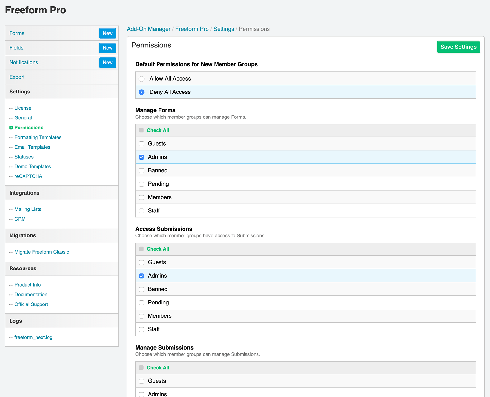

# Installation

* [Requirements](#requirements)
* [Installing Instructions](#install)
* [Quick Setup](#setup)

## Requirements <a href="#requirements" id="requirements" class="docs-anchor">#</a>
Solspace Freeform mostly meets the same requirements as listed on the [Craft Requirements](https://craftcms.com/docs/requirements) page.

* **Craft 2.6.2780 or later**
* PHP 5.4.0 or later
	* **IMPORTANT:** No support for PHP 5.3.x
* MySQL 5.1.0 or later
* Windows and OS X browsers:
	* Chrome 21 or later
	* Firefox 28 or later
	* Safari 9.0 or later
	* Internet Explorer 11 or later
	* Microsoft Edge

## Installing Instructions <a href="#install" id="install" class="docs-anchor">#</a>
1. Unzip the download package and copy the *freeform* folder to your Craft sites **/craft/plugins/** directory.
2. Go to the **Settings > Plugins** page and click **Install** for the *Freeform* plugin.

## Quick Setup <a href="#setup" id="setup" class="docs-anchor">#</a>
Follow the steps below to quickly get Solspace Freeform setup in minutes.

### Settings <a href="#settings" id="settings" class="docs-anchor">#</a>
To customize and configure Solspace Freeform settings, visit the [Settings](settings.md) page (**Freeform > Settings**).

### Permissions <a href="#permissions" id="permissions" class="docs-anchor">#</a>
Solspace Freeform ties into regular Craft User Group Permissions. Simply visit the permissions page for the applicable user group(s) (**Settings > Users > User Groups**) to grant/edit/remove permissions to Solspace Freeform.

* **General**
	* *Access Freeform* - required for users to access Solspace Freeform at all.
* **Freeform**
	* *Access Submissions* - access to the Submissions list page.
		* *Manage All Submissions* - can view, edit or delete any submission, regardless of per form selection below.
		* *For "MY FORM NAME"* - can view, edit or delete submissions for this form.
	* *Access Forms* - access to the Forms list page.
		* *Manage Forms* - can create, edit or delete forms.
	* *Access Fields* - access to the Fields list page.
		* *Manage Fields* - can create, edit or delete fields.
	* *Access Email Templates* - access to the Email Templates list page.
		* *Manage Email Templates* - can create, edit or delete email notification templates.
	* *Access Settings* - can access and update settings area for Freeform.

### Demo Templates <a href="#demo-templates" id="demo-templates" class="docs-anchor">#</a>
Install the [Demo Templates](demo-templates.md) (**Freeform > Settings > Demo Templates**) to get Freeform up and running on the front end with just a couple clicks!
