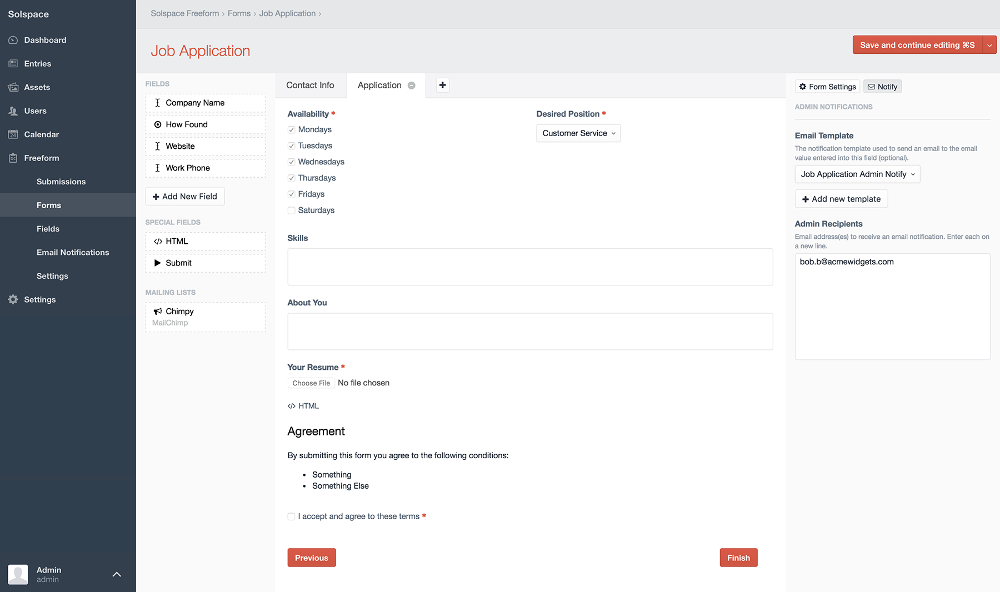
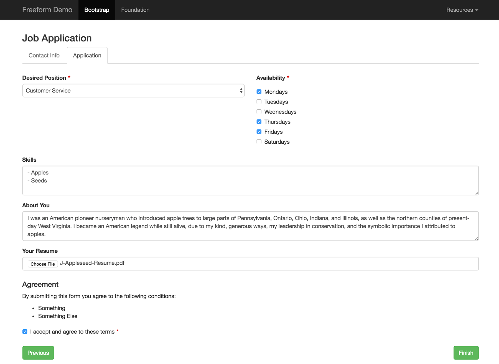

# Multi-Page Forms

Freeform Next allows for *multi-page* forms (a POST submit per page). Here's some important information to know about them:

* Each page is submitted through POST
	* There is no unique URI segment per page at this time.
	* Users cannot jump ahead to different pages, only forward and backward 1 page.
* Sessions for incomplete submissions are stored for 3hrs, and then are removed after that.
* Users can go backward in forms (if enabled).
	* Any data entered into the current page that has NOT yet been submitted "forward" will not be saved when clicking **Previous** submit button. As in, clicking the Previous button will not save any changes you made to that form page.
* If an earlier page contains file upload field(s), files will actually be uploaded before the form is officially submitted.
	* If the form is never completed, the submission clearing (described above) will remove the file after 3hrs.
