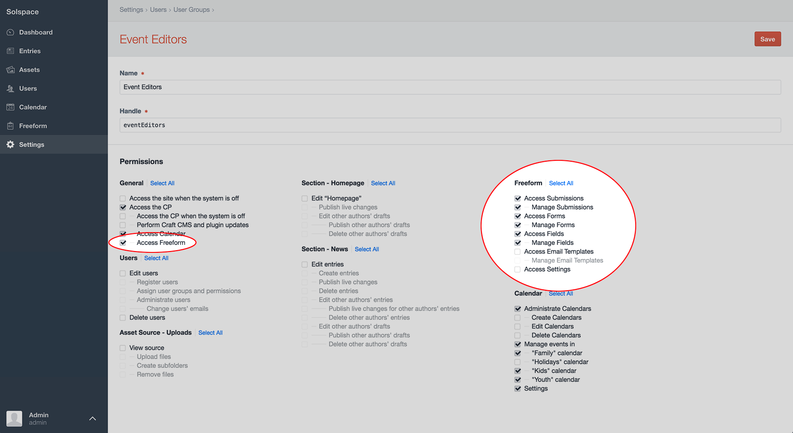

# Permissions

Freeform includes member group Permission controls to allow or deny access to various pages and parts of the Freeform control panel. Simply visit the Freeform permissions page (**Freeform** > **Settings** > **Permissions**) to grant/edit/remove permissions to Freeform. Super Admins ALWAYS have full access.

* *Default Permissions for New Member Groups*
	* Select whether newly created member groups should automatically be allowed or denied access to Freeform's permissions (member groups created later on).
* *Manage Forms* - can create, edit or delete forms. All members will have access to view list of forms.
* *Access Submissions* - access to the Submissions list page.
* *Manage Submissions* - can view, edit or delete any or all submissions.
* *Access Fields* - access to the Fields list page and ability to create, edit or delete fields.
* *Access Export* - access to the Export Profiles list page and running of exports.
* *Access Settings* - can access and update various settings areas for Freeform, including Email Notification Templates, Formatting Templates, Statuses, etc.
* *Access Integrations* - can access and create, edit or delete API integrations.
* *Access Resources* - show or hide the Resource links in the left Freeform nav.
* *Access Logs* - access to the Freeform error logs.
