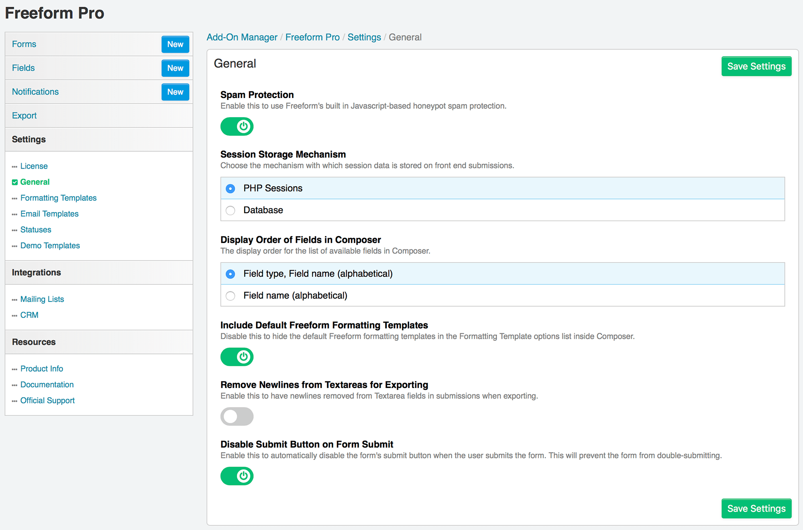
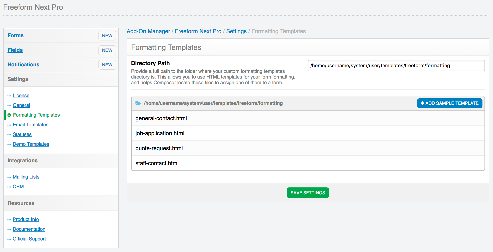

#Plugin Settings

*Solspace Freeform* includes several settings that allow you to customize your form management experience. To adjust your settings, click the **Settings** menu item while in the *Solspace Freeform* plugin, or go to **Settings > Plugins > Freeform** and click the settings cog icon.

The settings allow you to adjust:

* *License* <a href="#license" id="license" class="docs-anchor">#</a>
	* **License key** <a href="#license-key" id="license-key" class="docs-anchor">#</a>
		* This isn't a required field, but it allows you to keep track of your licenses easier. Simply enter the Freeform license key you received here.
* *General Settings* <a href="#general-settings" id="general-settings" class="docs-anchor">#</a>
	* **Spam Protection** <a href="#spam-protection" id="spam-protection" class="docs-anchor">#</a>
		* Freeform includes its own Javascript-based honeypot spam protection. This is enabled by default, but can be disabled here.
		* For more information, visit the [Spam Protection documentation](spam-protection.md).
	* **Default view** <a href="#default-view" id="default-view" class="docs-anchor">#</a>
		* This setting allows you to specify which Freeform page should be loaded by default when clicking the Freeform navigation link.
* *Formatting Templates* <a href="#formatting-templates" id="formatting-templates" class="docs-anchor">#</a>
	* **Form Template Directory** <a href="#form-template-directory" id="form-template-directory" class="docs-anchor">#</a>
		* When using custom formatting templates for your forms, you'll need to specify where your Twig-based templates are stored.
		* Provide a relative path to craft root to your custom form templates directory.
			* Ex: **templates/freeform**
		* To add a starter example template, click the "Add a sample template" button, and then edit the template after.

* *Statuses* <a href="#statuses" id="statuses" class="docs-anchor">#</a>
	* This area allows you to manage and create new statuses for your forms.
		* You can set the default status to be set for all forms here.

* *Demo Templates* <a href="#demo-templates" id="demo-templates" class="docs-anchor">#</a>
	* Allows you to install the [Demo Templates](demo-templates.md) to get Freeform up and running on the front end with just a couple clicks!
* *Mailing Lists* <a href="#mailing-lists" id="mailing-lists" class="docs-anchor">#</a>
	* The Mailing Lists area allows you to manage your mailing list API integrations.
	* Mailing list integrations are set up here and are globally available to all forms, but are configured per form inside the Composer interface.
	* Freeform includes *MailChimp* integration built in.
	* To shop for other mailing list integrations, visit the [Freeform Marketplace](https://solspace.com/craft/freeform/marketplace/mailinglist).
	* To connect to a mailing list API, click the **New Mailing List Integration** at the top right.
		* View the [Mailing List API Integration](mailing-list-integrations.md) documentation for more information about setting up and configuring.

* *CRM* <a href="#crm" id="crm" class="docs-anchor">#</a>
	* The CRM area allows you to manage your CRM (Customer Relationship Management) API integrations.
	* CRM integrations are set up here and are globally available to all forms, but are configured per form inside the Composer interface.
	* Freeform does not include any CRM integrations built in.
	* To shop for CRM integrations, visit the [Freeform Marketplace](https://solspace.com/craft/freeform/marketplace/crm).
	* To connect to a CRM API, click the **New CRM Integration** at the top right.
		* View the [CRM API Integration](crm-integrations.md) documentation for more information about setting up and configuring.
