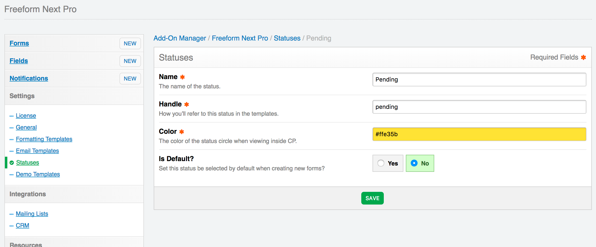

# Settings

Freeform Next includes several settings that allow you to customize your form management experience. To adjust your settings, click the **Settings** menu item while in the Freeform Next plugin, or go to **Settings > Plugins > Freeform** and click the settings cog icon.

The settings allow you to adjust:

* *License* <a href="#license" id="license" class="docs-anchor">#</a>
	* **License key** <a href="#license-key" id="license-key" class="docs-anchor">#</a>
		* This isn't a required field, but it allows you to keep track of your licenses easier. Simply enter the Freeform license key you received here.
* *General* <a href="#general" id="general" class="docs-anchor">#</a>
	* **Spam Protection** <a href="#spam-protection" id="spam-protection" class="docs-anchor">#</a>
		* Freeform includes its own Javascript-based honeypot spam protection. This is enabled by default, but can be disabled here.
		* For more information, visit the [Spam Protection documentation](spam-protection.md).
	* **Display Order of Fields in Composer** <a href="#display-order" id="display-order" class="docs-anchor">#</a>
		* This setting allows you to set the display order for the list of available fields in Composer.
* *Formatting Templates* <a href="#formatting-templates" id="formatting-templates" class="docs-anchor">#</a>
	* **Directory Path** <a href="#formatting-directory-path" id="formatting-directory-path" class="docs-anchor">#</a>
		* When using custom formatting templates for your forms, you'll need to specify where your HTML templates are stored.
		* Provide a full path to your Freeform Next formatting templates directory (whatever you want it to be named, wherever you want it located).
			* E.g. **/home/username/www/public_html/freeform-formatting** or **/home/username/www/system/user/templates/freeform-formatting**
		* To add a starter example template, click the "Add a sample template" button, and then edit the template after.

* *Email Templates* <a href="#email-templates" id="email-templates" class="docs-anchor">#</a>
	* This area is for users that wish to use HTML template files for email notifications. See [Email Notifications](email-notifications.md) documentation for more information about implementation.
	* **Directory Path** <a href="#email-directory-path" id="email-directory-path" class="docs-anchor">#</a>
		* Provide a full path to your Freeform Next email notifications templates directory (whatever you want it to be named, wherever you want it located).
			* E.g. **/home/username/www/public_html/freeform-emails** or **/home/username/www/system/user/templates/freeform-emails**
		* To add a starter example template, click the "Add a sample template" button, and then edit the template after.
	* **Default Email Notification Creation Method** <a href="#default-email-method" id="default-email-method" class="docs-anchor">#</a>
		* Select which storage method to use when creating new email notifications with **Add New Notification** option in Composer.
			* **Database Entry** - Use CP-based database template editor.
			* **Template File** - Use HTML template files.

* *Statuses* <a href="#statuses" id="statuses" class="docs-anchor">#</a>
	* This area allows you to manage and create new statuses for your forms.
		* You can set the default status to be set for all forms here.

* *Demo Templates* <a href="#demo-templates" id="demo-templates" class="docs-anchor">#</a>
	* Allows you to install the [Demo Templates](demo-templates.md) to get Freeform Next up and running on the front end with just a couple clicks!
