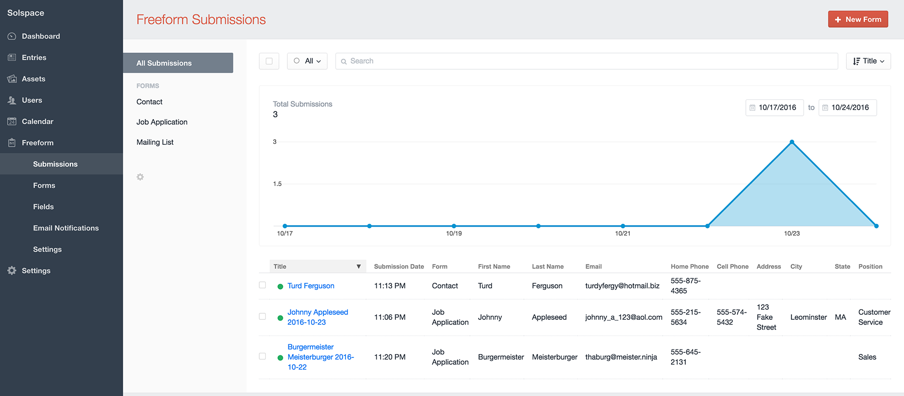
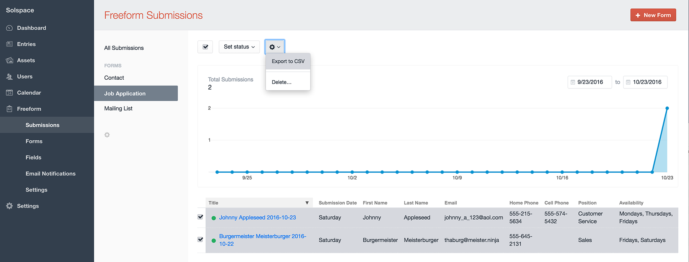

# Submissions

Similar to Craft Entries, every time a user submits a form, we refer to those as submissions. Currently, submissions can be viewed and edited in the control panel, and displayed on the front end in templates as a list and individually.

## In the Control Panel <a href="#control-panel" id="control-panel" class="docs-anchor">#</a>

The list of submissions in the control panel appears very similar to how regular Craft Entries are displayed. You can filter the view by form (or show across all forms), search into submissions, adjust which field columns are shown, and click into any of the submissions to edit them.

Additionally, Freeform includes a chart that gives you a quick visual of how many form submissions your site is receiving.

## Exporting Submissions <a href="#exporting" id="exporting" class="docs-anchor">#</a>

Freeform currently includes some basic exporting functionality.

To export some or all of your Freeform submissions:
* Select a Form name from the left sub navigation menu
    * You currently cannot export while in **All Submissions** view)
* Select the submissions you wish to export (or click select all checkbox at top).
* In the settings cog icon button at the top, click it and select **Export to CSV**.

An upcoming version of Freeform will include more exporting options and flexibility.

## In Front End Templates <a href="#templates" id="templates" class="docs-anchor">#</a>

One common use-case might be displaying the contents of the form submission to the user that submitted it right after they have successfully submitted the form, allowing them to review what they submitted. Of course, be aware that there are security implications here if the submissions contain sensitive content.

If the information is not sensitive, and meant to be public - like comments, you can also display submissions in a paginated (or not) list.

For more information about this, please visit the [freeform.submissions](freeform.submissions.md) template function documentation.
