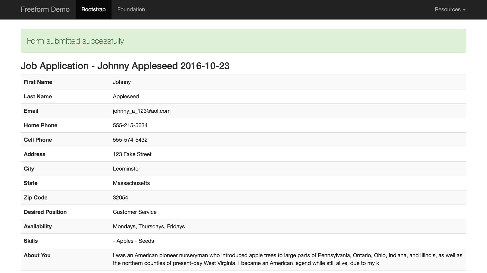

# Freeform_Next:Submissions tag

The *Freeform_Next:Submissions* template tag fetches an individual submission or list of submissions based on some or no criteria.

[](images/templates_submission.png)

* [Parameters](#parameters)
* [Variables](#variables)
* [Variable Pairs](#variable-pairs)
* [Conditionals](#conditionals)
* [Examples](#examples)


## Parameters <a href="#parameters" id="parameters" class="docs-anchor">#</a>

* `date_range` <a href="#param-date_range" id="param-date_range" class="docs-anchor">#</a>
	* Ability to limit results that were submitted within a specified timeframe.
	* Options are:
		* `today`
		* `this week`
		* `this month`
		* `last month`
		* `this year`
* `date_range_start` <a href="#param-date_range_start" id="param-date_range_start" class="docs-anchor">#</a>
	* Ability to limit results that were submitted within a specified timeframe.
	* Used in conjunction with [date_range_end](#param-date_range_end) parameter.
	* Specify a date in which you want entry submissions to start at (be no older than), using standard EE date syntax, or [PHP datetime and relative formats](http://php.net/manual/en/datetime.formats.php). E.g.:
		* `date_range_start="2017-01-01 12:00 PM"`
		* `date_range_start="2 weeks ago"`
* `date_range_end` <a href="#param-date_range_end" id="param-date_range_end" class="docs-anchor">#</a>
	* Ability to limit results that were submitted within a specified timeframe.
	* Used in conjunction with [date_range_start](#param-date_range_start) parameter.
	* Specify a date in which you want entry submissions to stop at (be no newer than), using standard EE date syntax, or [PHP datetime and relative formats](http://php.net/manual/en/datetime.formats.php). E.g.:
		* `date_range_end="2017-12-31 12:00 PM"`
		* `date_range_end="1 month"`
* `form` <a href="#param-form" id="param-form" class="docs-anchor">#</a>
	* Handle of the form, e.g. `form="composer_form"`, or an array of handles: `form="composer_form|client_survey"`.
	* Use `form="not composer_form"` to select all submissions EXCEPT the ones for **Composer Form** form.
* `form_id` <a href="#param-form_id" id="param-form_id" class="docs-anchor">#</a>
	* The ID of the form, e.g. `form_id="2"`, or array of ID's, e.g. `form_id="1|2|3"`.
	* If you want to select all form submissions EXCEPT the form with an ID of **1**, use `form_id="not 1"`.
* `limit` <a href="#param-limit" id="param-limit" class="docs-anchor">#</a>
	* Supply the maximum number of submissions you want to be returned, e.g. `limit="25"`
* `offset` <a href="#param-offset" id="param-offset" class="docs-anchor">#</a>
	* Skip the first specified amount of entries in the results, e.g. `offset="2"`
* `orderby` <a href="#param-orderby" id="param-orderby" class="docs-anchor">#</a>
	* Use `title`, `date`, `status` or any field handle to order by that value, e.g. `orderby="first_name"`.
* `paginate` <a href="#param-paginate" id="param-paginate" class="docs-anchor">#</a>
	* Control where the pagination will display. Options are `top`, `bottom`, or `both`. E.g. `paginate="both"`.
	* Used in conjunction with the `submission:paginate` variable pair.
* `sort` <a href="#param-sort" id="param-sort" class="docs-anchor">#</a>
	* The sort order of the results. Use `asc` or `desc`, e.g. `sort="asc"`.
* `status` <a href="#param-status" id="param-status" class="docs-anchor">#</a>
	* Specify a status to fetch submissions with a certain status, e.g. `status="open"`, or an array of statuses: `status="open|pending"`.
* `submission_id` <a href="#param-submission_id" id="param-submission_id" class="docs-anchor">#</a>
	* Used to limit results to a specific submission or set of submissions, e.g. `submission_id="22"`, or array of ID's, e.g. `submission_id="22|45|56"`


## Variables <a href="#variables" id="variables" class="docs-anchor">#</a>

* `{form:name}` <a href="#var-form-name" id="var-form-name" class="docs-anchor">#</a>
	* The name of the form the submission belongs to.
	* For form ID, use `{form:id}`
	* For form handle, use `{form:handle}`
* `{submission:id}` <a href="#var-id" id="var-id" class="docs-anchor">#</a>
	* The submission's unique ID.
* `{submission:date}` <a href="#var-date" id="var-date" class="docs-anchor">#</a>
	* The date the submission was submitted, e.g. `{submission:date format="%Y-%m-%d %g:%i %a"}`
* `{submission:title}` <a href="#var-title" id="var-title" class="docs-anchor">#</a>
	* The submission's title.
* `{submission:FIELD_HANDLE:value}` <a href="#var-field-handle-value" id="var-field-handle-value" class="docs-anchor">#</a>
	* Manually access any field in the submission's form by the field's handle. If you have a field with a handle `first_name`, you can access its value by calling `{submission:first_name:value}` or get its label with `{submission:first_name:label}`
	* The following variables are available for rendering field data:
		* `{submission:FIELD_HANDLE:value}` - the submitted value. Array values get joined via a `,` separator.
		* `{submission:FIELD_HANDLE:label}` - the label of the field.
		* `{submission:FIELD_HANDLE:type}` - the type of field, e.g. `checkbox_group`, `textarea`, etc.
	* See [{submission:fields}](#varpair-fields) variable pair for automated approach.
* `{submission:status}` <a href="#var-status" id="var-status" class="docs-anchor">#</a>
	* The status of the submission.
	* For status color, use `{submission:status_color}`, which returns the HEX value, e.g. `#ff0000`
	* For status handle, use `{submission:status_handle}`
* `{submission:absolute_count}` <a href="#var-absolute_count" id="var-absolute_count" class="docs-anchor">#</a>
	* Returns the absolute position number of the submission within the list of results, including paginated results.
* `{submission:absolute_results}` <a href="#var-absolute_results" id="var-absolute_results" class="docs-anchor">#</a>
	* Returns the absolute total amount of submissions being displayed in the results, including paginated results. Typically used in a conditional statement.
* `{submission:count}` <a href="#var-count" id="var-count" class="docs-anchor">#</a>
	* Returns the position number for each result in the list of submissions (within the page, if using pagination).
* `{submission:total_results}` <a href="#var-total_results" id="var-total_results" class="docs-anchor">#</a>
	* Returns the total amount of submissions being displayed in the results (within the page, if using pagination). Typically used in a conditional statement.
* `{submission:switch}` <a href="#var-switch" id="var-switch" class="docs-anchor">#</a>
	* Allows you to switch a CSS class back and fourth for all outputted results, e.g. `{submission:switch="style_one|style_two"}`
* `{submission:attachment_count}` <a href="#var-attachment_count" id="var-attachment_count" class="docs-anchor">#</a>
	* Returns the total number of files uploaded across all file upload fields for the submission. For example, if you had 2 fields that were the **file upload** field type, and one had 2 file uploads within it, while the other had one, and each contained files uploaded, the total value would be **3**.


## Variable Pairs <a href="#variable-pairs" id="variables" class="docs-anchor">#</a>

* `{submission:fields}{/submission:fields}` <a href="#varpair-fields" id="varpair-fields" class="docs-anchor">#</a>
	* Contains all fields that store values (doesn't include HTML fields, submit fields, mailing-list fields).
	* The following variables are available for rendering field data:
		* `{field:value}` - the submitted value. Array values get joined via a `,` separator.
		* `{field:label}` - the label of the field
		* `{field:handle}` - the handle of the field
		* `{field:type}` - the type of field, e.g. `checkbox_group`, `textarea`, etc
* `{submission:paginate}{/submission:paginate}` <a href="#varpair-paginate" id="varpair-paginate" class="docs-anchor">#</a>
	* Renders pagination for submission results. Works just like regular EE pagination, but the  variable pair is prepended with `submission:`. Used in conjunction with the [paginate](#param-paginate) parameter.
	* Can be displayed as one of two ways:

```{submission:paginate}
	Page {current_page} of {total_pages} pages.
	{pagination_links}
{/submission:paginate}```

```{submission:paginate}
	<ul class="pagination">
	{pagination_links}
	{first_page}
		<li><a href="{pagination_url}">First</a></li>
	{/first_page}
	{previous_page}
		<li><a href="{pagination_url}">&laquo; Previous</a></li>
	{/previous_page}
	{page}
		<li{if current_page} class="active"{/if}><a href="{pagination_url}">{pagination_page_number}</a></li>
	{/page}
	{next_page}
		<li><a href="{pagination_url}">Next &raquo;</a></li>
	{/next_page}
	{last_page}
		<li><a href="{pagination_url}">Last</a></li>
	{/last_page}
	{/pagination_links}
	</ul>
{/submission:paginate}```


## Conditionals <a href="#conditionals" id="conditionals" class="docs-anchor">#</a>

* `{if submission:no_results}{/if}` <a href="#cond-no-results" id="cond-no-results" class="docs-anchor">#</a>
	* Displays its contents when there are no results found for this template tag with the given set of parameters.


## Example Usage in Templates <a href="#examples" id="examples" class="docs-anchor">#</a>

Display a simple list of submissions:

	<ul>
	{exp:freeform_next:submissions
		form="contact"
		limit="20"
		orderby="date" sort="desc"
	}
		<li>
			<a href="{path='form/submission/{submission:id}'}">{submission:title}</a>
			{submission:date format="%Y-%m-%d %g:%i %a"}
		</li>
		{if submission:no_results}
			<li>There are currently no submissions for this form.</li>
		{/if}
	{/exp:freeform_next:submissions}
	</ul>

---

Display a more complete table view of submissions with table heading (generated by [Freeform_Next:Form tag](form.md)) and pagination:

	{exp:freeform_next:form
		form="contact"
		no_form_tags="true"
	}

		<h3>{form:name}</h3>

		<table class="table table-striped">
			<thead>
				<tr>
					<th>#</th>
					<th>Title</th>
					<th>Date</th>
					<th>Status</th>
					{form:fields}
						{if field:can_store_values}
							<th>{field:label}</th>
						{/if}
					{/form:fields}
					<th>Files</th>
				</tr>
			</thead>
			<tbody>

			{exp:freeform_next:submissions
				form="contact"
				limit="20"
				orderby="date" sort="desc"
				paginate="bottom"
			}
				<tr>
					<td>{submission:id}</td>
					<td><a href="{path='form/submission/{submission:id}'}">{submission:title}</a></td>
					<td>{submission:date format="%Y-%m-%d %g:%i %a"}</td>
					<td><span style="color: {submission:status_color};">{submission:status}</span></td>
					{submission:fields}
						{if field:can_store_values}
							<td>{field:value}</td>
						{/if}
					{/submission:fields}
					<td>{submission:attachment_count} file{if submission:attachment_count != "1"}s{/if}</td>
				</tr>
				{if submission:no_results}
					<tr>
						<td colspan="100">There are currently no submissions for this form.</td>
					</tr>
				{/if}
				{submission:paginate}
					<tr>
						<td colspan="100">
							<ul class="pagination">
							{pagination_links}
								{first_page}
									<li><a href="{pagination_url}">First</a></li>
								{/first_page}
								{previous_page}
									<li><a href="{pagination_url}">&laquo; Previous</a></li>
								{/previous_page}
								{page}
									<li{if current_page} class="active"{/if}>
										<a href="{pagination_url}">{pagination_page_number}</a>
									</li>
								{/page}
								{next_page}
									<li><a href="{pagination_url}">Next &raquo;</a></li>
								{/next_page}
								{last_page}
									<li><a href="{pagination_url}">Last</a></li>
								{/last_page}
							{/pagination_links}
							</ul>
						</td>
					</tr>
				{/submission:paginate}
			{/exp:freeform_next:submissions}
			</tbody>
		</table>

	{/exp:freeform_next:form}

---

Display a single submission, complete with special handling for file fields:

	{exp:freeform_next:submissions
		form="contact"
		submission_id="{segment_3}"
	}

		<h3>{form:name} - {submission:title}</h3>

		<table class="table table-striped">
			{submission:fields}
			<tr>
				<th style="width: 20%;">{field:label}</th>
				<td>
				{if field:type == "file"} {!-- special handling for File fields --}
					{if field:value}
						{exp:file:entries file_id="{field:value}" dynamic="no"}
							{if extension == "gif" OR extension == "jpg" OR extension == "jpeg" OR extension == "png"}
								
							{if:else}
								<a href="{file_url}">{title}</a>
							{/if}
						{/exp:file:entries}
					{if:else}
						No file(s) uploaded
					{/if}
				{if:else}
					{field:value}
				{/if}
				</td>
			</tr>
			{/submission:fields}
		</table>

		{if submission:no_results}
			<div class="alert">
				Sorry, no submission was found.
			</div>
		{/if}

	{/exp:freeform_next:submissions}

---

Display a single submission with manually set variables:

	{exp:freeform_next:submissions
		form="contact"
		submission_id="{segment_3}"
	}

		<table class="table table-striped">
			<tr>
				<th style="width: 20%;">Name</th>
				<td>{submission:first_name:value} {submission:last_name:value}</td>
			</tr>
			<tr>
				<th>{submission:email:label}</th>
				<td>{submission:email:value}</td>
			</tr>
			<tr>
				<th>Date Submitted</th>
				<td>{submission:date format="%l, %F %j, %Y at %g:%i%a"}</td>
			</tr>
			{if submission:file_upload:value}
				<tr>
					<th>{submission:file_upload:label}</th>
					<td>
						{exp:file:entries file_id="{submission:file_upload:value}"}
							{if extension == "gif" OR extension == "jpg" OR extension == "jpeg" OR extension == "png"}
								
							{if:else}
								<a href="{file_url}">{title}</a>
							{/if}
						{/exp:file:entries}
					</td>
				</tr>
			{/if}
		</table>

		{if submission:no_results}
			<div class="alert">
				Sorry, no submission was found.
			</div>
		{/if}

	{/exp:freeform_next:submissions}
