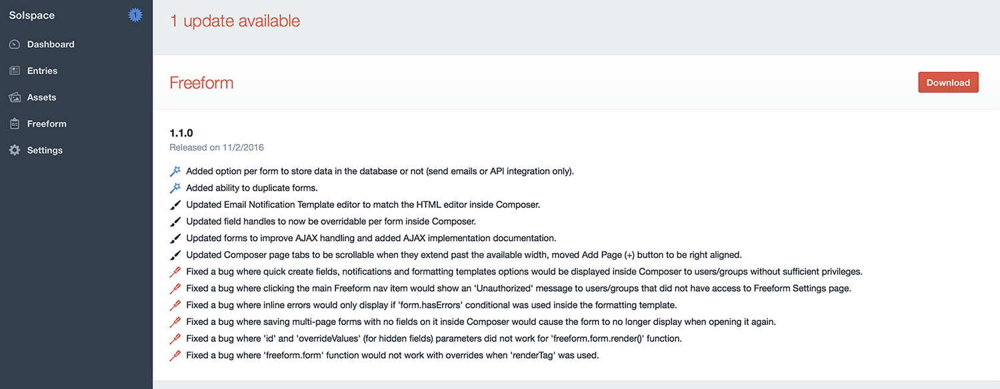

# Updates

## Updating Instructions <a href="#update" id="update" class="docs-anchor">#</a>
*Solspace Freeform* uses the **Craft Update Service**, which means that every time there's an update available, it'll show up in the **Updates** area of the Craft control panel. You can then review the changelog there, or [view it here](changelog.md).

To download the update, simply click the download button (you'll be taken to your account area on the Solspace site) and download the updated package for *Solspace Freeform*. Then follow the steps below:

1. Within your Craft sites **/craft/plugins/** directory, delete the *freeform* folder.
2. Unzip the download package and copy the new *freeform* folder to your Craft sites **/craft/plugins/** directory.
3. Visit the Craft control panel and let the upgrade routine run.
