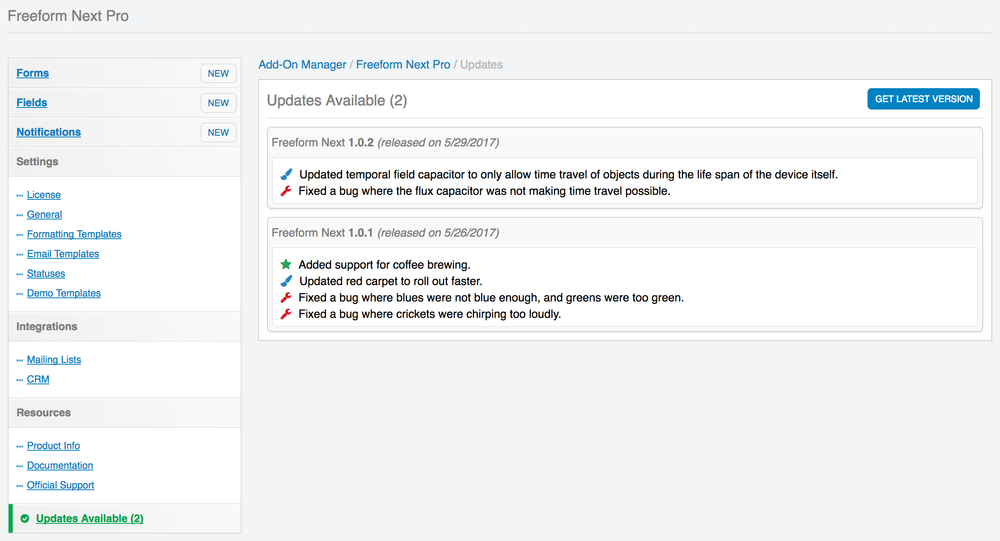

# Updates

## Updating Instructions <a href="#update" id="update" class="docs-anchor">#</a>
**NOTE:** If you're switching from Freeform Classic to the new Freeform, please see the [Switching from Freeform Classic](switching-from-classic.md) documentation to learn more about the differences, and then view the [Migration utility](classic-migration.md) documentation to prepare your site for migration. Freeform can be used alongside classic Freeform/Freeform Pro (Freeform Classic) installations if you're wanting to try out and/or switch to Freeform.

**NOTE:** If you're upgrading from Freeform **Lite** to Freeform **Pro**, you can follow these same instructions below. There will be no **update** button/process as it is not required, though you may see the **Update** button if the version number is greater (e.g. Lite 1.5.3 to Pro 1.6.4).

Freeform has its own **Update Service** built in, which means that every time there's an update available, an **Updates Available** nav item will show up in the Freeform add-on area of the EE control panel. You can then review the changelog there, or [view it here](changelog.md).

To download the update, simply click the **Get Latest Version** button, and you'll be taken to your account area on the Solspace site where you can log in and download the updated package for Freeform. Then follow the steps below:

1. Within your EE site's **./system/user/addons/** and **./themes/user/** directories, delete the *freeform_next* folders.
2. Unzip the download package:
	* Copy the *freeform_next* folder to your EE site's **./system/user/addons/** directory.
	* Open the **themes** folder and copy the *freeform_next* folder to your EE sites **./themes/user/** directory.
3. Go to the *Add-Ons* area (under **Developer** navigation tab), scroll to down to the **Third Party Add-Ons** section, and find *Freeform Pro* (or *Freeform Lite*) in the list, and click the **Update** button.
