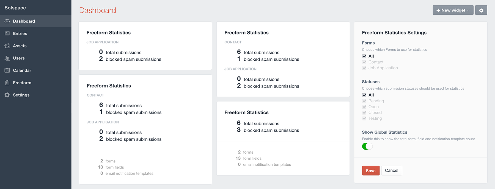

# Dashboard Widgets

There are 5 dashboard widgets available for Freeform. Four of these are available as an addon bundle for purchase in the [Freeform Marketplace](https://solspace.com/craft/freeform/marketplace/widgets), and one basic widget is included with Freeform.

* [Linear Chart widget](#linear-chart)
* [Radial Chart widget](#radial-chart)
* [Field Values Chart widget](#field-values-chart)
* [Recent Submissions widget](#recent-submissions)
* [Statistics widget](#statistics) (included with Freeform)

## Linear Chart widget <a href="#linear-chart" id="linear-chart" class="docs-anchor">#</a>

This widget is sold separately as a part of the *Widgets Bundle* in the [Freeform Marketplace](https://solspace.com/craft/freeform/marketplace/widgets). This widget allows you to display a **line** or **bar** chart form your submissions. Colors of forms for charts are automatically generated by Freeform, but you can customize each form's color in the Form Settings property editor column in Composer.

Configuration options are as follows:

* **Title** - customize the title of widget
* **Chart type** - choose from **Line** or **Bar**
* **Chart Height** - customize the height display of widget
* **Select the date range**:
	* Last 24 hours
	* Last 7 days
	* Last 30 days
	* Last 60 days
	* Last 90 days
* **Show all form data as a single combined line?**
	* If enabled, it combines all selected forms into a single value to be displayed as a line/bars.
* **Forms** - choose from **All** forms or select which ones you want to show data for

## Radial Chart widget <a href="#radial-chart" id="radial-chart" class="docs-anchor">#</a>

This widget is sold separately as a part of the *Widgets Bundle* in the [Freeform Marketplace](https://solspace.com/craft/freeform/marketplace/widgets). This widget allows you to display a **pie**, **donut** or **polar area** chart form your submissions. Colors of forms for charts are automatically generated by Freeform, but you can customize each form's color in the Form Settings property editor column in Composer.

Configuration options are as follows:

* **Title** - customize the title of widget
* **Chart type** - choose from **Pie**, **Donut** or **Polar Area**
* **Chart Height** - customize the height display of widget
* **Select the date range**:
	* Last 24 hours
	* Last 7 days
	* Last 30 days
	* Last 60 days
	* Last 90 days
* **Forms** - choose from **All** forms or select which ones you want to show data for

## Field Values Chart widget <a href="#field-values-chart" id="field-values-chart" class="docs-anchor">#</a>

This widget is sold separately as a part of the *Widgets Bundle* in the [Freeform Marketplace](https://solspace.com/craft/freeform/marketplace/widgets). This widget allows you to display a **pie**, **donut** or **polar area** chart based on options selected from submissions for a specific form. Colors of field values for charts are automatically generated by Freeform and cannot be adjusted.

Configuration options are as follows:

* **Title** - customize the title of widget
* **Chart type** - choose from **Pie**, **Donut** or **Polar Area**
* **Chart Height** - customize the height display of widget
* **Select the date range**:
	* Last 24 hours
	* Last 7 days
	* Last 30 days
	* Last 60 days
	* Last 90 days
* **Form** - choose a form you want to show data for
* **Field** - choose a field you want to show data for
* **Show empty values?**
	* Disable this if you don't want empty values to be factored into the results

## Recent Submissions widget <a href="#recent-submissions" id="recent-submissions" class="docs-anchor">#</a>

This widget is sold separately as a part of the *Widgets Bundle* in the [Freeform Marketplace](https://solspace.com/craft/freeform/marketplace/widgets). This widget allows you to display a list of the most recent submissions from your form(s).

Configuration options are as follows:

* **Title** - customize the title of widget
* **Limit** - select the total number of submissions you'd like to be displayed
* **Forms** - choose from **All** forms or select which ones you want to show submissions from.

## Stats widget <a href="#stats" id="stats" class="docs-anchor">#</a>

This is a simple widget (included with Freeform) that allows you to display some basic information about your Freeform submissions and setup. You can display stats for all forms or for individual form(s), as well as filter the stats by statuses.

When running into issues with Freeform, it can particularly be helpful when contacting Solspace Support (by just taking a screenshot of it), as it provides a glimpse of your setup and amount of data.

* Total submissions
* Blocked spam submissions
	* Counts can be reset per form in **Freeform > Forms** page.
* Total number of forms
* Total number of form fields
* Total number of email notification templates
